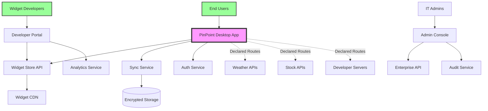
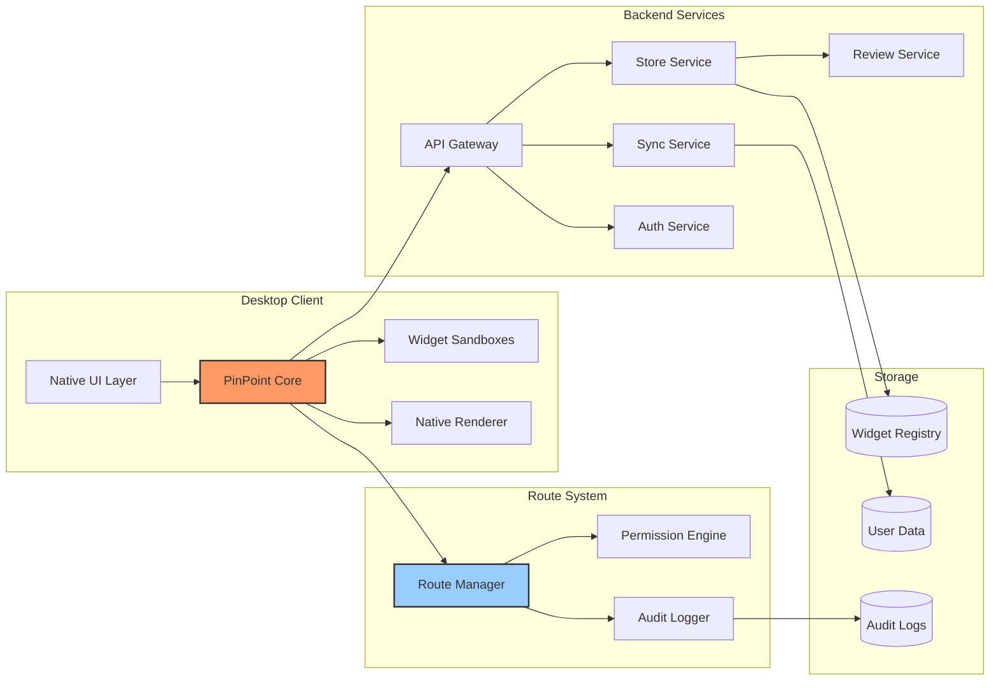
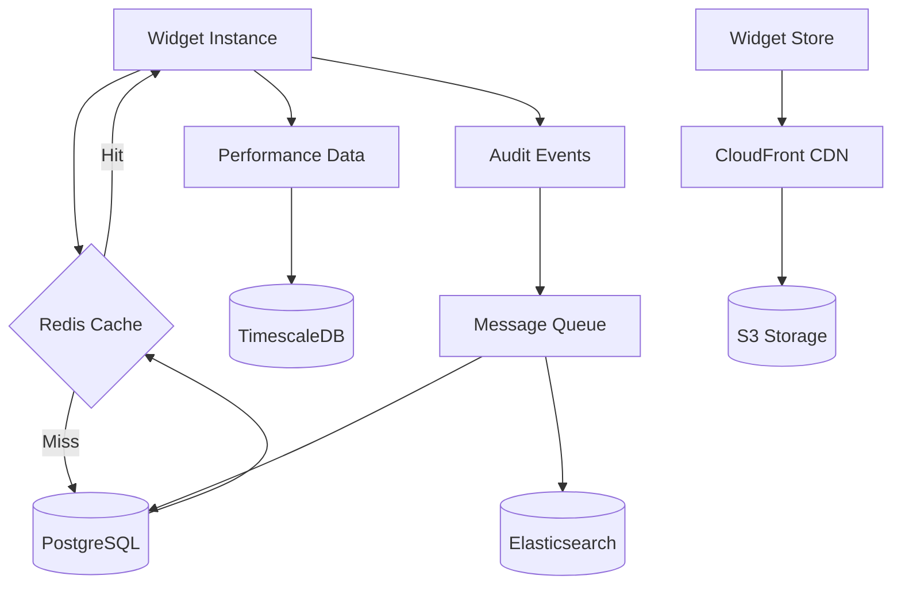

1. Executive Summary
# Software Architecture Plan

## 1. Executive Summary

### 1.1 Project Overview
PinPoint is a desktop application that serves as a widget ecosystem, allowing users to pin customizable widgets to their desktop. It provides a standardized framework ensuring consistent UI/UX, security, and performance across all widgets while offering developers a familiar and flexible development environment.
### 1.2 Key Architectural Decisions
### Decision 1: Native-First Rendering Architecture
**What we chose:** Native rendering engine with web-based widget logic

**How it works:**
- Widgets are written in JavaScript/HTML (easy for developers)
- But they render using native graphics (Metal on Mac, DirectX on Windows)
- Like how games achieve smooth 60-120 FPS

**Why this gives iPhone-like smoothness:**
- Animations run on the GPU (graphics card)
- No web browser overhead for visuals
- Same technology iOS uses for smooth scrolling

---

### Decision 2: Smart Performance Management
**What we chose:** Automatic quality adjustment based on system resources

**How it works:**
- PinPoint monitors system performance
- Adjusts widget quality automatically
- Prioritizes smoothness over features when needed

**Example:**
```
High-end PC: 
  → Full animations at 120 FPS
  → Real-time updates
  → Advanced visual effects

Older laptop:
  → Smooth 60 FPS maintained
  → Simpler animations
  → Updates optimized
```

---

### Decision 3: Shared Resource System
**What we chose:** All widgets share core resources instead of duplicating them

**Think of it like:**
- An apartment building where everyone shares electricity/water (efficient)
- vs. Every apartment having its own power plant (wasteful)

**Benefits:**
- 10x less memory usage
- Faster widget startup
- More widgets can run simultaneously

---

### Decision 4: Progressive Permission System
**What we chose:** Permissions are checked once at startup, not constantly

**How it works:**
- When widget starts: Full security check
- During operation: Ultra-fast cached permissions
- Result: Security without slowdown

**Like iPhone apps:**
- Ask for camera permission once
- Then camera works instantly every time

---

### Decision 5: Route-Based Data Flow and System Permission Routes
**What we chose:** Pre-defined data and system paths that users can understand

**The routes:**
- Data Routes: Control where data can flow (servers (which level of encryption), storage)
- System Routes: Control what system resources widgets can access

**Why this matters:**
- Developers know the rules upfront
- No confusion or hidden behaviors
- Complete transparency: Users see both "where data goes" AND "what system access"
- Better security: Can't access clipboard without declaring it
- Clearer permissions: "This widget needs camera access" is obvious
---
### 1.3 Major Components

### 1. PinPoint Engine (The Brain)
**What it does:** Manages everything, like iOS manages iPhone apps

**Key features:**
- Starts/stops widgets instantly
- Manages memory like a phone (suspends unused widgets)
- Handles all the complex stuff so widgets stay simple

---

### 2. Native Render Engine (The Artist)
**What it does:** Makes everything look beautiful and smooth

**How it works:**
- Uses same technology as video games
- 60-120 frames per second
- Butter-smooth animations
- Hardware accelerated (uses graphics card)

**User experience:**
- Dragging widgets feels instant
- Animations are fluid like iPhone
- No stuttering or lag

---

### 3. Widget Sandbox (The Security Guard)
**What it does:** Keeps each widget in its own safe space

**Like iPhone apps:**
- Each widget is isolated
- Can't access other widgets' data
- Can't harm your system
- But still runs fast

---

### 4. Permission Manager (The Gatekeeper)
**What it does:** Controls what widgets can access

**Smart features:**
- Visual permission dashboard
- One-click privacy modes
- See exactly what each widget accesses
- Change permissions anytime

**Example display:**
```
Weather Widget wants to:
✅ Location (for local weather)
✅ Internet (to fetch forecasts)
❌ Contacts (not needed - blocked)
❌ Files (not needed - blocked)

[Allow] [Customize] [Deny]
```

---

### 5. Widget Store (The Marketplace)
**What it does:** Safe place to discover and install widgets

**Features:**
- One-click install
- Automatic updates
- User reviews
- Security scanning
- Developer showcase

---

### 6. Developer Kit (The Toolbox)
**What it does:** Makes it easy to build great widgets

**Includes:**
- Simple widget templates
- Visual design tools
- Performance profiler
- One-click publishing

**Developer experience:**
```javascript
// Building a widget is this simple:
class MyWidget extends PinPoint.Widget {
  render() {
    return <Clock style="elegant" />
  }
}
```

---

### 7. Performance Monitor (The Optimizer)
**What it does:** Keeps everything running smoothly

**How it helps:**
- Automatically suspends inactive widgets
- Prevents any widget from slowing system
- Optimizes battery usage on laptops
- Shows performance stats to users

---

## The Result: iPhone-Smooth Desktop Widgets

### What users experience:
1. **Instant Response** - Click and drag with zero delay
2. **Smooth Animations** - 60-120 FPS like iPhone
3. **Beautiful Visuals** - Native rendering quality
4. **Always Responsive** - System never slows down
5. **Clear Privacy** - See and control all data flow

### What developers get:
1. **Easy Development** - Use familiar web technologies
2. **Automatic Optimization** - Platform handles performance
3. **Rich Animations** - Access to native effects
4. **Happy Users** - Smooth experience = good reviews

### What makes PinPoint special:
- **Performance of native apps** (like iPhone widgets)
- **Security of web apps** (sandboxed and safe)
- **Transparency of open source** (clear data flows)
- **Business model of app stores** (sustainable ecosystem)
---

## 2. Architecture Vision & Goals

### 2.1 Business Goals
- **Strategic Objectives**
  - "Create a 'closed city' platform where widgets operate on pre-defined, transparent routes"
  - "Make data flow as clear as street signs - users always know where their data travels"
- **Success Metrics**
  - User Adoption: 100K users in Year 1, 1M+ by Year 2
  - Developer Ecosystem: 1,000 widgets available by Month 6, 10,000 by Year 2
  - Revenue Targets: $1M ARR by Year 1 (subscriptions + developer revenue share)
  - Platform Health: 4.5+ star average rating, <0.1% security incidents, 99.9% uptime
  - Engagement: Average 5 widgets per user, 80% daily active users
- **Constraints**
  - Initial team of 5-10 developers
  - Must work on Windows/Mac from day 1, Linux can wait
  - Cannot compromise on security/privacy for features
- **Assumptions**
  - Users want desktop widgets but current solutions are inadequate
  - Developers will build widgets if monetization exists
  - Privacy-conscious market is large enough to sustain business
  - Native performance is critical for user adoption

### 2.2 Technical Goals
- **Performance Targets**
  - Widget Startup: <50ms from click to interactive
  - Frame Rate: Consistent 60 FPS minimum, 120 FPS capable
  - Memory Usage: <20MB per widget baseline, <200MB for 10 widgets
  - CPU Usage: <0.1% per idle widget, <5% total when inactive
  - Battery Impact: No more than 10% reduction in battery life
  - Launch Time: PinPoint app cold start <2 seconds

- **Scalability Requirements**
  - Concurrent Widgets: Support 50+ widgets on high-end systems, 10+ on basic systems
  - Widget Store: Handle 1M+ daily active users browsing/downloading
  - Developer Platform: Support 100K+ widget submissions and updates
  - Multi-Monitor: Seamless support for 4+ displays
  - Widget Complexity: From simple clocks to complex real-time visualizations
  - Update System: Push updates to 1M+ widgets within 24 hours
  
- **Security Objectives**
  - Zero Day Protection: Sandbox escape impossible by design
  - Privacy Guarantee: User data routing transparent and controlled
  - Malware Prevention: 99.99% malicious widgets caught before distribution
  - Audit Trail: Complete logging of all system access and data flows
  - Secure Distribution: Code signing and integrity verification for all widgets
  - Rapid Response: Ability to remotely disable malicious widgets within minutes

- **Maintainability Goals**
  - Code Quality: 80%+ test coverage, automated CI/CD pipeline
  - Widget SDK Stability: Breaking changes max once per year
  - Platform Updates: Security patches within 48 hours, features monthly
  - Developer Experience: Widget creation to store submission in <1 hour
  - Documentation: 100% API coverage, tutorials for top 20 use cases
  - Monitoring: Real-time platform health, widget crash reporting, performance metrics
---
- **Vision Statement**

"PinPoint transforms the desktop into a living, productive workspace where beautiful, secure widgets provide information and functionality at a glance. Like iPhone brought apps to mobile, PinPoint brings the infrastructure for the enabling of intelligent widgets to desktop - with with uncompromising performance, security, and user control over their data."
## 3. Requirements Analysis

### 3.1 Functional Requirements

#### Core Features
- Widget Marketplace - A secure store where users discover and install widgets (like city's main gate)
- Route Declaration System - Every widget must declare which data and system-level routes it uses (city registration)
  Data Routes: 🟢 Local, 🟡 Encrypted, 🟠 AI-Enhanced, 🔴 Full
  System Routes: 🟢 Citizen, 🟡 Observer, 🟠 Interactive, 🔴 Privileged
- Visual Permission Dashboard - Users see and control each widget's routes and permissions
- Widget Sandbox Engine - Isolated execution environment for each widget (like separate houses)
- Native Rendering System - Smooth 60-120 FPS animations using GPU acceleration
- Multi-Monitor Support - Widgets can be placed on any screen in multi-display setups
- Developer SDK & Tools - Complete toolkit for creating, testing, and publishing widgets
- Live Widget Updates - Widgets update in real-time without freezing or stuttering
- Secure Payment System - For premium widgets and developer payouts
- Widget Backup & Sync - Save widget layouts and settings across devices
#### User Stories
```
For End Users:
As a productivity-focused user
I want to see my calendar, todos, and emails at a glance
So that I can stay organized without switching between apps

As a privacy-conscious user  
I want to see exactly where my data goes or how deep the widget tweak my system (which route)
So that I can trust the widgets I'm using

As a stock trader
I want real-time stock prices on my desktop with programable notification
So that I can monitor markets while working

As a general user
I want the routes and system-level to be good and easy to understand 
defined, so I'm not confused between choices

For Developers:
As a widget developer
I want clear documentation and simple APIs
So that I can build widgets quickly

As a developer
I want to monetize my widgets
So that I can sustain development

As a developer
I want to choose between privacy routes
So that I can offer both simple and feature-rich versions

As a developer
I want the routes and system-level to be good and easy to understand 
defined, so I know user of my app does not get confused and does not use
this platform

For IT Administrators:
As an IT admin
I want to control which widgets employees can install
So that I can maintain security compliance

As an IT admin
I want to see audit logs of widget data access
So that I can ensure no data leaks occur

```

#### Business Rules
- Widget Review Required - All widgets must pass automated and manual review before store listing 
- Route Declaration Mandatory - Widgets cannot access any data/systems outside their declared routes
- Revenue Share 90/10 - Developers keep 90% of widget sales/subscriptions
- One-Strike Malware Policy - Any developer publishing malware is permanently banned
- Privacy Label Accuracy - Misrepresenting data routes results in immediate widget removal
- Performance Standards - Widgets using >25% CPU or >100MB RAM fail review
- Update Review Fast-Track - Security updates reviewed within 24 hours
- User Data Portability - Users can export all their widget data at any time
- Refund Window - 24-hour refund period for paid widgets
- Open Source Option - Developers can optionally open-source widgets for trust

### 3.2 Non-Functional Requirements

| Category | Requirement | Target |
| :--- | :--- | :--- |
| **Performance** | Widget Startup Time | < 50ms |
| **Performance** | Frame Rate | 60 FPS minimum, 120 FPS capable |
| **Performance** | Memory per Widget | < 20MB baseline |
| **Performance** | CPU Usage (Idle) | < 0.1% per widget |
| **Security** | Sandbox Escape | Zero tolerance - impossible by design |
| **Security** | Code Signing | All widgets cryptographically signed |
| **Security** | Permission Model | Capability-based with user consent |
| **Security** | Data Encryption | AES-256 for "Encrypted Highway" route |
| **Reliability** | Platform Uptime | 99.9% (< 9 hours downtime/year) |
| **Reliability** | Widget Crash Isolation | One widget crash doesn't affect others |
| **Reliability** | Data Durability | 99.999% for synced widget data |
| **Usability** | Install Time | < 5 seconds from click to running |
| **Usability** | Learning Curve | Grandparent-friendly interface |
| **Usability** | Accessibility | WCAG 2.1 AA compliance |
| **Scalability** | Concurrent Widgets | 50+ on high-end, 10+ on basic systems |
| **Scalability** | Store Capacity | 1M+ widgets, 100M+ users |
| **Scalability** | Update Distribution | 1M widgets updated in < 24 hours |
| **Compliance** | Data Protection | GDPR, CCPA compliant |

### 3.3 Constraints
- **Technical Constraints**
  - Cross-Platform from Day 1 - Must support Windows 10/11 and macOS 12+ immediately
  - No Admin Rights Required - PinPoint must install and run without administrator privileges
  - Existing Tech Stack - Must use JavaScript/TypeScript for widgets (developer familiarity)
  - GPU Requirement - Requires DirectX 11/Metal support for native rendering
  - Internet Optional - Core features must work offline (except store and sync)
  - No Browser Engine - Cannot use Chromium/WebKit (too heavy for widgets)
- **Business Constraints**
  - Developer Acquisition - Need 100+ widgets at launch (chicken-egg problem)
  - No Ads in Core - Revenue from subscriptions/sales only, no advertising
  - Privacy Reputation - Cannot have any privacy scandals in first 2 years
  - Patent Landscape - Must avoid existing widget/dashboard patents
  
- **Critcal Success Requirements**
Must Have (MVP):
  - Route-based security system working
  - 10+ high-quality widgets at launch
  - Smooth 60 FPS performance
  - One-click install process
  - Basic widget store
Should Have (6 months):

- Developer monetization
- Widget sync across devices
- 100+ widgets available
- Enterprise features

Nice to Have (Year 1):

- Linux support
- Mobile companion app
- AI-powered features
- Widget analytics dashboard
---

## 4. High-Level Architecture

### 4.1 Architecture Style
- **Pattern**: Hybrid Client-Service Architecture with Plugin System
Core: Monolithic desktop application (for performance)
Widgets: Plugin-based architecture (for isolation)
Backend: Microservices (for scalability)
- **Justification**: 
Monolithic Core: Native performance requires tight integration with OS. Shared resources (renderer, compositor) work best in single process
Plugin Widgets: Each widget runs in isolated sandbox - security through separation while maintaining performance through shared runtime
Microservices Backend: Widget store, user accounts, and sync services scale independently. Can add AI services, analytics without affecting core
Why not pure microservices: Desktop performance requires native integration. Network latency would kill the "iPhone smooth" experience
Why not pure monolithic: Widgets need isolation for security. Mixed architecture gives best of both worlds

### 4.2 System Context



### 4.3 Component Overview



#### Component Responsibilities

| Component | Responsibility |
|-----------|----------------|
| PinPoint Core | Main application runtime - manages widget lifecycle, resource allocation, and coordinates all subsystems. The "brain" of the desktop app |
| Widget Sandboxes | Isolated V8 contexts where widget JavaScript runs. Each widget gets its own sandbox with enforced memory/CPU limits |
| Native Renderer | GPU-accelerated rendering engine using Metal/DirectX. Composites all widgets at 60-120 FPS for smooth performance |
| Route Manager | Enforces the "city routes" - ensures widgets only access declared data paths. Blocks unauthorized network/system access |
| Permission Engine | Manages user consent for widget capabilities. Caches permissions for performance, enforces at runtime |
| Audit Logger | Records all widget data access and system interactions. Provides transparency and debugging capabilities |
| Native UI Layer | Platform-specific UI (Win32/Cocoa) for system integration, tray icon, and widget chrome |
| API Gateway | Single entry point for all backend services. Handles authentication, rate limiting, and request routing |
| Store Service | Widget marketplace backend - handles browsing, search, downloads, reviews, and developer uploads |
| Sync Service | Encrypted synchronization of widget data and layouts across user's devices |
| Auth Service | User authentication and account management. Supports social login and 2FA |
| Review Service | Automated and manual widget review pipeline. Scans for malware, validates routes, tests performance |
| Widget Registry DB | Store all widget metadata, versions, developer info, and review status |
| User Data DB | Encrypted storage for user preferences, widget configurations, and sync data |
| Audit Logs DB | Tamper-proof storage of all system access logs for compliance and security analysis |
---
### 4.4 Data Flow for Key Scenarios
- Installing a Widget:
sequenceDiagram
    User->>UI: Browse Store
    UI->>Core: Request Widget List
    Core->>Gateway: GET /widgets
    Gateway->>Store: Fetch Popular
    Store-->>Gateway: Widget List
    Gateway-->>Core: Widget Data
    Core-->>UI: Display Widgets
    
    User->>UI: Install Widget
    UI->>Core: Download Widget
    Core->>RouteManager: Validate Routes
    RouteManager->>PermissionEngine: Check Permissions
    PermissionEngine-->>UI: Show Permission Dialog
    User->>UI: Approve
    
    Core->>Gateway: Download Widget Package
    Gateway->>CDN: Fetch Package
    CDN-->>Core: Widget Code
    Core->>Sandbox: Create New Sandbox
    Sandbox->>Renderer: Register Widget
    Renderer-->>UI: Widget Displayed

- Widget Accessing Data (Route Enforcement):
sequenceDiagram
    Widget->>Sandbox: fetch("weather.com/api")
    Sandbox->>RouteManager: Check Route Permission
    RouteManager->>RouteManager: Validate Against Declared Routes
    alt Route Allowed
        RouteManager->>AuditLogger: Log Access
        RouteManager-->>Sandbox: Permission Granted
        Sandbox->>Network: Make Request
        Network-->>Widget: Weather Data
    else Route Blocked
        RouteManager->>AuditLogger: Log Violation
        RouteManager-->>Sandbox: Permission Denied
        Sandbox-->>Widget: Error: Unauthorized Route
    end

### 4.5 Deployment View
graph TB
    subgraph "User's Computer"
        PinPointApp[PinPoint.app/exe]
        LocalStorage[(Local Widget Data)]
        GPU[GPU - Native Rendering]
    end
    
    subgraph "PinPoint Cloud - AWS/Azure"
        subgraph "Frontend"
            CloudFront[CDN - Widget Downloads]
            ALB[Load Balancer]
        end
        
        subgraph "Application Layer"
            API1[API Server 1]
            API2[API Server 2]
            Review1[Review Worker]
        end
        
        subgraph "Data Layer"
            RDS[(PostgreSQL - Metadata)]
            S3[(S3 - Widget Packages)]
            DynamoDB[(DynamoDB - User Prefs)]
        end
    end
    
    subgraph "Developer Infrastructure"
        DevAPI[Developer APIs]
        DevPortal[Dev Portal Web]
    end
    
    PinPointApp --> CloudFront
    PinPointApp --> ALB
    ALB --> API1
    ALB --> API2
    
    API1 --> RDS
    API1 --> S3
    API1 --> DynamoDB
    
    DevAPI --> Review1
    Review1 --> S3
    
## 5. Detailed Design

### 5.1 Component Architecture

#### Component: 
- PinPoint Core Component:
**Purpose**: The central orchestrator that manages everything - like the city's control center.
**Internal structure**:
PinPoint Core:
  ├── Widget Lifecycle Manager
  │   ├── Widget Loader (installs/starts widgets)
  │   ├── State Manager (saves/restores widget positions)
  │   ├── Resource Monitor (tracks CPU/memory usage)
  │   └── Crash Handler (isolates widget failures)
  │
  ├── Event System
  │   ├── User Input Router (mouse/keyboard to widgets)
  │   ├── System Event Handler (sleep/wake, display changes)
  │   └── Widget Communication Bus (if allowed between widgets)
  │
  ├── Platform Integration
  │   ├── OS API Bridge (Windows/macOS specific features)
  │   ├── System Tray Manager
  │   └── Notification Service
  │
  └── Core Services
      ├── Update Manager (handles PinPoint and widget updates)
      ├── Telemetry Service (anonymous usage stats)
      └── Crash Reporter
**Interfaces/APIs**:
// Widget Management API
interface WidgetManager {
  installWidget(widgetId: string): Promise<Widget>
  uninstallWidget(widgetId: string): Promise<void>
  startWidget(widgetId: string): Promise<void>
  stopWidget(widgetId: string): Promise<void>
  getRunningWidgets(): Widget[]
  setWidgetPosition(widgetId: string, x: number, y: number): void
}

// Resource Management API
interface ResourceManager {
  getWidgetResources(widgetId: string): ResourceUsage
  setResourceLimit(widgetId: string, limits: ResourceLimits): void
  suspendWidget(widgetId: string): void
  resumeWidget(widgetId: string): void
}
**Dependencies**:
Native OS APIs (Win32/Cocoa)
Widget Sandbox Engine
Native Renderer
Route Manager

#### Widget Sandbox Component: 
**Purpose**: Secure isolation environment for each widget - like each house in our city
**Internal Structure**:
Widget Sandbox:
  ├── V8 Isolate Instance
  │   ├── JavaScript Context
  │   ├── Memory Heap (isolated)
  │   └── Execution Thread
  │
  ├── Security Boundary
  │   ├── API Filter (only allowed APIs exposed)
  │   ├── Network Interceptor
  │   ├── File System Jail
  │   └── IPC Channel (to Core)
  │
  ├── Resource Controls
  │   ├── CPU Throttler
  │   ├── Memory Limiter
  │   ├── Network Rate Limiter
  │   └── Disk I/O Controller
  │
  └── Widget Runtime
      ├── PinPoint Widget API
      ├── DOM Emulation (lightweight)
      ├── Event Handlers
      └── Lifecycle Hooks

**Interfaces/API**:
// Exposed to Widgets (inside sandbox)
interface PinPointWidgetAPI {
  // Storage
  storage: {
    local: {
      get(key: string): Promise<any>
      set(key: string, value: any): Promise<void>
    }
    sync?: { // Only if sync route declared
      get(key: string): Promise<any>
      set(key: string, value: any): Promise<void>
    }
  }
  
  // Network (filtered by routes)
  fetch(url: string, options?: RequestInit): Promise<Response>
  
  // UI
  render(element: VirtualElement): void
  on(event: string, handler: Function): void
  
  // System (limited access)
  system: {
    getTime(): Date
    getCPUUsage?(): number // Only if permission granted
  }
}

#### Route Manager Component
**Purpose**: The "traffic control" system that enforces data flow routes
**Internal structure**:
Route Manager:
  ├── Route Registry
  │   ├── Declared Routes Database
  │   ├── Route Validation Engine
  │   └── Route Pattern Matcher
  │
  ├── Request Interceptor
  │   ├── Network Request Filter
  │   ├── File Access Filter
  │   ├── System API Filter
  │   └── IPC Filter
  │
  ├── Route Enforcement
  │   ├── Real-time Validator
  │   ├── Policy Engine
  │   ├── Violation Handler
  │   └── Audit Trail Generator
  │
  └── Route Analytics
      ├── Usage Tracker
      ├── Performance Monitor
      └── Anomaly Detector
### 5.2 Data Architecture

#### Data Models
```
# Core Entities

Entity: User
├── id: UUID
├── email: String (unique)
├── username: String (unique)
├── password_hash: String
├── created_at: Timestamp
├── updated_at: Timestamp
├── subscription_tier: Enum ['free', 'pro', 'enterprise']
├── settings: JSON
│   ├── theme: String
│   ├── default_routes: Object
│   └── privacy_mode: String
└── metadata: JSON
    ├── last_login: Timestamp
    ├── device_count: Integer
    └── total_widgets: Integer

Entity: Widget
├── id: UUID
├── name: String
├── developer_id: UUID (FK -> Developer)
├── version: String
├── description: Text
├── icon_url: String
├── manifest: JSON
│   ├── routes: Object
│   │   ├── data: Array<DataRoute>
│   │   └── system: Array<SystemRoute>
│   ├── permissions: Object
│   └── requirements: Object
├── status: Enum ['pending', 'approved', 'rejected', 'suspended']
├── created_at: Timestamp
├── updated_at: Timestamp
└── metrics: JSON
    ├── downloads: Integer
    ├── rating: Float
    └── crash_rate: Float

Entity: WidgetInstance
├── id: UUID
├── user_id: UUID (FK -> User)
├── widget_id: UUID (FK -> Widget)
├── position: JSON {x, y, width, height, display}
├── settings: JSON (widget-specific settings)
├── enabled_routes: Array<String>
├── enabled_functions: Array<String>
├── created_at: Timestamp
└── last_active: Timestamp

Entity: Developer
├── id: UUID
├── user_id: UUID (FK -> User)
├── company_name: String
├── verified: Boolean
├── revenue_share: Float (default 0.7)
├── payment_info: Encrypted<JSON>
├── created_at: Timestamp
└── metrics: JSON
    ├── total_widgets: Integer
    ├── total_downloads: Integer
    └── revenue_ytd: Decimal

Entity: AuditLog
├── id: UUID
├── timestamp: Timestamp
├── widget_instance_id: UUID (FK -> WidgetInstance)
├── event_type: Enum ['data_access', 'system_call', 'permission_grant', 'violation']
├── route_type: String
├── details: JSON
│   ├── api_called: String
│   ├── data_sent: Object
│   ├── result: String
│   └── context: Object
└── ip_address: String

Entity: Review
├── id: UUID
├── widget_id: UUID (FK -> Widget)
├── reviewer_type: Enum ['automated', 'manual']
├── status: Enum ['pass', 'fail', 'conditional']
├── findings: JSON
│   ├── security_issues: Array
│   ├── performance_issues: Array
│   ├── route_violations: Array
│   └── suggestions: Array
├── created_at: Timestamp
└── reviewed_by: String
```

#### Database Design
- **Primary Database**: PostgreSQL 14+
Chosen for: ACID compliance, JSON support, complex queries
Stores: Users, Widgets, Developer accounts, Audit logs
Replication: Primary-replica setup for HA
Partitioning: Audit logs by month
- **Cache Layer**: Redis 7+
Chosen for: Sub-millisecond latency, pub/sub support
Caches:

- User sessions (TTL: 24h)
- Widget metadata (TTL: 1h)
- Permission matrices (TTL: 5m)
- Rate limiting counters

Cluster mode for scalability
- **Search Engine**: Elasticsearch 8+
Chosen for: Full-text search, analytics
Indexes:

- Widget catalog (names, descriptions, tags)
- Audit logs for compliance search
- Developer documentation
- User support tickets

- **Time-Series Database**: TimescaleDB

Chosen for: Performance metrics, usage analytics
Stores:

- Widget performance metrics (CPU, memory, FPS)
- User engagement data
- System health metrics
- Real-time usage patterns
- **Object Storage**: S3-compatible (MinIO self-hosted or AWS S3)
Stores:

- Widget packages (.ppw files)
- Widget icons and screenshots
- Crash dumps
- Backup archives
#### Data flow architecture



### 5.3 Security Architecture

#### Authentication & Authorization
- **Method**: JWT with Refresh Tokens + OAuth2 for Social Login
Authentication Flow:
  1. Primary: Email/Password with JWT
     - Access Token: 15 minutes
     - Refresh Token: 30 days
     - Stored in: Secure HTTP-only cookies
  
  2. Social Login: OAuth2
     - Providers: Google, GitHub, Microsoft
     - Flow: Authorization Code with PKCE
  
  3. 2FA Options:
     - TOTP (Google Authenticator)
     - SMS (Twilio)
     - WebAuthn (Hardware keys)
- **Provider**: Self-hosted with Keycloak
Why: Full control, no vendor lock-in, enterprise features
Alternatives considered: Auth0 (cost), Cognito (AWS lock-in)

- **Authorization Model: RBAC with Route-Based Permissions**
// Permission Structure
{
  "user_id": "uuid",
  "roles": ["user", "developer"],
  "widget_permissions": {
    "widget_instance_id": {
      "data_routes": ["local-only", "encrypted-sync"],
      "system_routes": ["citizen", "observer"],
      "functions": ["basic_features", "sync"],
      "restrictions": {
        "rate_limits": {"api_calls": 100},
        "time_windows": ["business_hours"]
      }
    }
  }
}
#### Data Protection
 **Encryption at Rest**:
Method: AES-256-GCM
Key Management: AWS KMS or HashiCorp Vault
Implementation:
´´´
Application Level:
  - User payment info: Field-level encryption
  - Developer credentials: Encrypted JSON fields
  - Sensitive widget data: Encrypted before storage

Database Level:
  - PostgreSQL: Transparent Data Encryption (TDE)
  - Redis: Encryption via Redis Enterprise
  - S3: SSE-S3 with customer keys

Backup Encryption:
  - All backups encrypted with separate keys
  - Key rotation every 90 days
´´´

- **Encryption in Transit**: 
Method: TLS 1.3 minimum
Certificate: Let's Encrypt with auto-renewal
Implementation:
´´´
External Communication:
  - All APIs: HTTPS only
  - WebSocket: WSS with TLS
  - Widget downloads: HTTPS with integrity check

Internal Communication:
  - Service mesh: mTLS (Istio)
  - Database connections: SSL required
  - Cache connections: TLS with auth

Widget-to-Server:
  - Certificate pinning for critical APIs
  - Route-specific encryption levels:
    - Local-only: No network
    - Encrypted-sync: E2E encryption
    - AI-enhanced: TLS + app-level encryption
    - Full-featured: TLS minimum
´´´

#### Additional Security Measures
- **Widget Code Security:**
Code Signing:
  - All widgets signed with developer certificate
  - Signature verified before execution
  - Certificate chain validation
  - Revocation checking (OCSP)

Sandboxing:
  - V8 isolates with restricted APIs
  - Capability-based security
  - Resource quotas enforced
  - No direct system calls

- **API Security:**
Rate Limiting:
  - Per user: 1000 requests/hour
  - Per widget: 100 requests/hour
  - Per developer: 10000 requests/hour
  - DDoS protection via CloudFlare

API Gateway Security:
  - Input validation on all endpoints
  - SQL injection prevention
  - XSS protection
  - CORS properly configured

- **Compliance & Auditing:**
Compliance:
  - GDPR: Right to deletion, data portability
  - CCPA: Privacy notices, opt-out
  - SOC2: Annual audits
  - HIPAA: Available for healthcare widgets

Audit Requirements:
  - All data access logged
  - Logs retained for 1 year
  - Real-time alerting for violations
  - Monthly compliance reports

- **Security Response Plan:**
Incident Response:
  - 24/7 security monitoring
  - 1-hour response time for critical issues
  - Remote widget disable capability
  - Automatic security patches
  
Vulnerability Management:
  - Bug bounty program
  - Regular penetration testing
  - Dependency scanning (Snyk)
  - Security advisories published


### 5.4 Integration Architecture

#### API Design
- **Style**: REST with GraphQL for Complex Queries
API Architecture:
  Public APIs:
    - REST: Simple CRUD operations, widget downloads
    - GraphQL: Widget discovery, complex searches, analytics
    - WebSocket: Real-time updates, live sync
  
  Internal APIs:
    - gRPC: Service-to-service communication
    - Message Queue: Async operations (RabbitMQ)
- **Versioning Strategy**: URL Path Versioning with Sunset Policy
Versioning:
  Format: /api/v{major}/resource
  Examples:
    - /api/v1/widgets
    - /api/v2/widgets (with breaking changes)
  
  Sunset Policy:
    - New version announcement: 6 months notice
    - Deprecation warnings: 3 months before
    - End of life: 12 months after new version
    - Legacy support: Critical security only
#### Message Formats
- **Widget Manifest Format:**
```json
{
  "version": "2.0",
  "widget": {
    "id": "com.example.weather",
    "name": "Weather Plus",
    "version": "1.2.3",
    "developer": {
      "id": "dev_123",
      "name": "Example Inc",
      "verified": true
    }
  },
  "routes": {
    "data": [
      {
        "id": "weather-api",
        "type": "public-api",
        "endpoints": ["api.weather.com"],
        "rateLimit": "60/hour",
        "cacheDuration": "5min"
      }
    ],
    "system": [
      {
        "id": "location",
        "type": "observer",
        "apis": ["geolocation"],
        "precision": "city",
        "refreshRate": "on-demand"
      }
    ]
  },
  "requirements": {
    "minPinPointVersion": "2.0.0",
    "platforms": ["windows", "macos"],
    "gpu": "optional"
  }
}
```
- **API Response Format:**
{
  "status": "success",
  "data": {
    "widgets": [
      {
        "id": "widget_123",
        "name": "Weather Plus",
        "rating": 4.8,
        "downloads": 50000
      }
    ],
    "pagination": {
      "page": 1,
      "limit": 20,
      "total": 485
    }
  },
  "metadata": {
    "requestId": "req_abc123",
    "timestamp": "2024-01-20T10:30:00Z",
    "version": "v1"
  }
}

- **Error Format:**
{
  "status": "error",
  "error": {
    "code": "ROUTE_VIOLATION",
    "message": "Widget attempted to access undeclared route",
    "details": {
      "widgetId": "widget_123",
      "attemptedRoute": "api.facebook.com",
      "allowedRoutes": ["api.weather.com"]
    }
  },
  "metadata": {
    "requestId": "req_xyz789",
    "timestamp": "2024-01-20T10:30:00Z",
    "documentation": "https://docs.pinpoint.app/errors/ROUTE_VIOLATION"
  }
}
#### Integration Patterns
- **Widget-to-Platform Communication:**
// Widget SDK provides standardized interface
class PinPointSDK {
  // Route-aware fetch
  async fetch(url, options = {}) {
    // Validate against declared routes
    const route = this.validateRoute(url);
    if (!route) {
      throw new RouteViolationError(url);
    }
    
    // Add route metadata
    const headers = {
      ...options.headers,
      'X-PinPoint-Widget': this.widgetId,
      'X-PinPoint-Route': route.id,
      'X-PinPoint-Route-Type': route.type
    };
    
    // Execute with monitoring
    const response = await this.monitoredFetch(url, {
      ...options,
      headers
    });
    
    // Log for audit
    this.auditLog('data_access', {
      url,
      route: route.id,
      status: response.status
    });
    
    return response;
  }
  
  // System API access
  async system(api, params = {}) {
    // Check system route permissions
    const permission = await this.checkSystemPermission(api);
    if (!permission.granted) {
      throw new PermissionDeniedError(api);
    }
    
    // Rate limiting
    if (!this.rateLimiter.check(api)) {
      throw new RateLimitError(api);
    }
    
    // Execute system call
    return await this.bridge.callSystem(api, params);
  }
}

- **Platform Event System:**
// Event types widgets can subscribe to
const PinPointEvents = {
  // System events
  'system.theme.changed': {
    data: { theme: 'dark' | 'light' }
  },
  'system.display.changed': {
    data: { displays: Array<Display> }
  },
  
  // Widget lifecycle
  'widget.settings.updated': {
    data: { settings: Object }
  },
  'widget.route.granted': {
    data: { route: Route }
  },
  
  // User events
  'user.focus.changed': {
    data: { hasFocus: boolean }
  }
};

// Widget subscription
widget.on('system.theme.changed', (event) => {
  this.updateTheme(event.data.theme);
});

#### External Service Integration:
- **Weather API Integration Example:**
// Platform proxy for external APIs
class ExternalAPIProxy {
  async proxyRequest(widgetId, route, request) {
    // Validate widget has permission
    if (!this.hasRoutePermission(widgetId, route)) {
      throw new UnauthorizedError();
    }
    
    // Apply rate limiting
    await this.rateLimiter.consume(widgetId, route);
    
    // Transform request
    const proxiedRequest = {
      ...request,
      headers: {
        ...request.headers,
        // Remove sensitive headers
        'X-PinPoint-Widget': undefined,
        // Add API key if platform manages it
        'X-API-Key': this.getAPIKey(route)
      }
    };
    
    // Make request
    const response = await fetch(route.endpoint, proxiedRequest);
    
    // Cache if configured
    if (route.cacheDuration) {
      await this.cache.set(
        this.getCacheKey(widgetId, request),
        response,
        route.cacheDuration
      );
    }
    
    // Return sanitized response
    return this.sanitizeResponse(response);
  }
}

#### Developer API Integration
 - **Widget Submission API:**
 // REST API for widget submission
POST /api/v1/developer/widgets
{
  "manifest": { /* widget manifest */ },
  "package": "base64_encoded_widget_package",
  "changelog": "Fixed weather API integration",
  "targetVersion": "2.0.0"
}

// Response
{
  "status": "success",
  "data": {
    "submissionId": "sub_123",
    "status": "pending_review",
    "estimatedReviewTime": "24-48 hours",
    "trackingUrl": "https://dev.pinpoint.app/submissions/sub_123"
  }
}

// GraphQL for complex developer queries
query DeveloperDashboard($developerId: ID!) {
  developer(id: $developerId) {
    widgets {
      id
      name
      version
      status
      metrics {
        downloads(period: LAST_30_DAYS)
        revenue(period: LAST_30_DAYS)
        rating
        crashRate
      }
      reviews(limit: 5) {
        rating
        comment
        createdAt
      }
    }
    earnings {
      total
      pending
      lastPayout
    }
  }
}

#### Enterprise Integration:
- **SSO Integration:**
SAML 2.0 Support:
  - Identity Providers: Okta, AD FS, Ping
  - Metadata Exchange: Automated
  - Attributes Mapping: Customizable
  
OIDC Support:
  - Providers: Any OIDC-compliant
  - Scopes: profile, email, groups
  - Claims: Mapped to PinPoint roles

- **Enterprise API:**
// Bulk widget deployment
POST /api/v1/enterprise/deployments
{
  "organizationId": "org_123",
  "widgets": [
    {
      "widgetId": "widget_456",
      "targetUsers": ["group:developers", "user:john@company.com"],
      "configuration": {
        "routes": {
          "data": ["local-only"], // Restrict to local only
          "system": ["citizen"]    // Minimal system access
        },
        "settings": {
          "companyServer": "https://internal.company.com"
        }
      }
    }
  ],
  "policy": {
    "mandatory": true,
    "allowUserDisable": false
  }
}

#### Webhook System:

- **Platform Webhooks:**
// Webhook configuration
POST /api/v1/developer/webhooks
{
  "url": "https://api.example.com/pinpoint-webhook",
  "events": [
    "widget.installed",
    "widget.uninstalled",
    "widget.crashed",
    "review.completed"
  ],
  "secret": "webhook_secret_key"
}

// Webhook payload
{
  "event": "widget.installed",
  "timestamp": "2024-01-20T10:30:00Z",
  "data": {
    "widgetId": "widget_123",
    "userId": "user_456",
    "version": "1.2.3",
    "platform": "windows"
  },
  "signature": "sha256=..." // HMAC signature
}

#### Migration & Compatibility:
- **Widget Migration API:**
// For migrating from v1 to v2 widgets
class WidgetMigrator {
  async migrate(v1Widget) {
    return {
      // Map old format to new
      manifest: {
        version: "2.0",
        widget: this.mapWidgetInfo(v1Widget),
        routes: this.inferRoutes(v1Widget),
        requirements: this.mapRequirements(v1Widget)
      },
      // Provide compatibility layer
      compatibilityMode: true,
      warnings: this.getMigrationWarnings(v1Widget)
    };
  }
}
---

# 6. Technology Stack

## 6.1 Platform Choices

| Layer | Technology | Justification |
|-------|------------|---------------|
| **Operating Systems** | Windows 10/11, macOS 12+, Ubuntu 22.04+ | Cover 95%+ of desktop users, native performance on each |
| **Cloud Provider** | AWS (primary), Azure (backup) | AWS for scale and services, Azure for enterprise customers |
| **Container Platform** | Docker + Kubernetes (EKS) | Industry standard, excellent orchestration, easy scaling |
| **CI/CD** | GitHub Actions + ArgoCD | GitOps workflow, automated deployments, infrastructure as code |
| **Monitoring** | Datadog + Prometheus/Grafana | Comprehensive monitoring, custom metrics for widgets |

## 6.2 Development Stack

### Frontend (Desktop Application)

**PinPoint Core Application**
- **Language**: TypeScript 5.0+
- **Framework**: Electron 28+ with native modules
- **UI Framework**: React 18+ for chrome UI
- **State Management**: Zustand (lightweight for desktop)
- **Build Tool**: Vite (fast builds, better DX than Webpack)
- **Native Bindings**: Node-API for performance-critical parts

```yaml
Key Libraries:
  Rendering:
    - WebGL2 for GPU acceleration
    - Skia-based canvas for 2D graphics
    - Three.js for 3D widgets (optional)
  
  IPC:
    - Custom IPC layer for widget communication
    - MessagePort API for secure channels
  
  Testing:
    - Vitest for unit tests
    - Playwright for E2E tests
    - Storybook for component library
```

**Widget SDK (What developers use)**
- **Language**: TypeScript/JavaScript
- **Framework**: Vanilla JS with optional React/Vue support
- **Build Tool**: Rollup (smaller bundles for widgets)
- **Type Definitions**: Comprehensive .d.ts files
- **Dev Tools**: Custom Chrome DevTools extension

```javascript
// Example widget development experience
import { Widget, Route } from '@pinpoint/sdk';

@Widget({
  name: 'Weather Plus',
  routes: {
    data: [Route.PublicAPI],
    system: [Route.Citizen]
  }
})
export class WeatherWidget extends BaseWidget {
  async render() {
    const weather = await this.fetch('api.weather.com');
    return this.html`
      <div class="weather">
        <h2>${weather.temp}°</h2>
        <p>${weather.condition}</p>
      </div>
    `;
  }
}
```

### Backend Services

**Core Platform Services**
- **Language**: Go 1.21+
- **Why Go**: Performance, concurrency, small memory footprint
- **Framework**: Gin (HTTP) + gRPC (internal services)
- **Database Driver**: pgx (PostgreSQL)
- **Validation**: go-playground/validator

```yaml
Service Architecture:
  API Gateway:
    - Framework: Gin + go-chi router
    - Rate Limiting: go-redis/redis_rate
    - Auth: JWT with refresh tokens
  
  Widget Store Service:
    - Search: Elasticsearch Go client
    - Storage: AWS SDK for S3
    - Queue: RabbitMQ with amqp091-go
  
  Review Service:
    - Sandboxing: gVisor integration
    - Static Analysis: Custom Go AST parser
    - Performance Testing: pprof integration
```

**Real-time Services**
- **Language**: Node.js 20 LTS with TypeScript
- **Framework**: Socket.io for WebSocket
- **Message Broker**: Redis Pub/Sub
- **Why Node**: Excellent for real-time, huge ecosystem

**Analytics Pipeline**
- **Language**: Python 3.11+
- **Framework**: FastAPI for REST endpoints
- **Data Processing**: Apache Spark with PySpark
- **ML Framework**: scikit-learn for anomaly detection
- **Time Series**: pandas + TimescaleDB connector

### Widget Runtime

**V8 Isolate Management**
- **Language**: C++ with V8 embedding
- **Bindings**: Node-API for JS interface
- **Memory Management**: Custom allocator with limits
- **Security**: Capability-based API restrictions

```cpp
// Simplified widget isolate creation
class WidgetIsolate {
  v8::Isolate* isolate;
  v8::Persistent<v8::Context> context;
  
public:
  WidgetIsolate(const WidgetManifest& manifest) {
    // Create isolate with resource constraints
    v8::ResourceConstraints constraints;
    constraints.set_max_memory(manifest.memoryLimit);
    
    v8::Isolate::CreateParams params;
    params.constraints = constraints;
    isolate = v8::Isolate::New(params);
    
    // Create secure context with filtered APIs
    context = CreateSecureContext(manifest.routes);
  }
};
```

**Native Renderer**
- **Graphics API**: 
  - Windows: Direct3D 12
  - macOS: Metal
  - Linux: Vulkan
- **Abstraction**: Custom layer similar to ANGLE
- **Compositing**: Inspired by Chromium's cc/

## 6.3 Infrastructure

### Compute
- **Container Hosting**: Amazon EKS (Kubernetes)
- **Serverless**: AWS Lambda for webhook processing
- **Edge Computing**: CloudFront Functions for routing
- **Batch Processing**: AWS Batch for review pipeline

### Storage
- **Primary Database**: Amazon RDS (PostgreSQL 14)
- **Cache**: Amazon ElastiCache (Redis 7)
- **Object Storage**: Amazon S3 with CloudFront CDN
- **Time Series**: TimescaleDB on EC2
- **Search**: Amazon OpenSearch Service

### Network
- **Load Balancer**: AWS ALB with WAF
- **API Gateway**: Kong Gateway on EKS
- **Service Mesh**: Istio for internal services
- **VPN**: WireGuard for admin access

### Security Infrastructure
- **Secrets Management**: HashiCorp Vault
- **Certificate Management**: Let's Encrypt + cert-manager
- **SIEM**: Splunk Cloud
- **Vulnerability Scanning**: Snyk + Trivy

### Monitoring & Observability
```yaml
Metrics:
  - Prometheus for metrics collection
  - Grafana for visualization
  - Custom dashboards per service

Logs:
  - Fluentd for log aggregation
  - Elasticsearch for log storage
  - Kibana for log analysis

Traces:
  - OpenTelemetry instrumentation
  - Jaeger for distributed tracing
  - Service dependency mapping

Alerts:
  - PagerDuty integration
  - Slack notifications
  - Custom escalation policies
```

## 6.4 Development Tools

### Local Development
```yaml
Required Tools:
  - Docker Desktop for services
  - Node.js 20 LTS
  - Go 1.21+
  - Python 3.11+
  - Rust (for native modules)

Development Environment:
  - VS Code with PinPoint extension
  - Local K8s with Kind
  - LocalStack for AWS services
  - Tilt for hot reloading
```

### Widget Development Kit
```yaml
CLI Tool:
  - Name: pinpoint-cli
  - Language: Go (single binary)
  - Features:
    - Widget scaffolding
    - Local testing environment
    - Performance profiling
    - Submission to store

Widget Simulator:
  - Electron app for testing
  - Simulates all routes
  - Performance monitoring
  - Debug tools integration
```

### Testing Infrastructure
```yaml
Unit Testing:
  - Frontend: Vitest + React Testing Library
  - Backend Go: Native testing + testify
  - Backend Node: Jest
  - Widget SDK: Vitest

Integration Testing:
  - API Tests: Postman/Newman
  - Service Tests: Docker Compose
  - Contract Tests: Pact

E2E Testing:
  - Desktop App: Playwright
  - Widget Tests: Custom framework
  - Performance: K6 for load testing

Security Testing:
  - SAST: SonarQube
  - DAST: OWASP ZAP
  - Dependency: Snyk
  - Container: Trivy
```

## 6.5 Platform-Specific Considerations

### Windows
```yaml
Build Tools:
  - Visual Studio 2022 Build Tools
  - Windows SDK 10.0.22621.0
  - WiX Toolset for installer

Native Modules:
  - Direct3D 12 for rendering
  - Windows Runtime APIs
  - Credential Manager API
```

### macOS
```yaml
Build Tools:
  - Xcode 15+
  - macOS SDK 14.0
  - Notarization tooling

Native Modules:
  - Metal for rendering
  - Core Animation
  - Keychain Services API
```

### Linux
```yaml
Build Tools:
  - GCC 11+ or Clang 15+
  - AppImage tools
  - Snapcraft (optional)

Native Modules:
  - Vulkan for rendering
  - libsecret for credentials
  - D-Bus for system integration
```

## 6.6 Version Management

```yaml
Versioning Strategy:
  PinPoint Core: Semantic Versioning (2.1.0)
  Widget SDK: Locked to Core major version
  APIs: URL versioning (/v1/, /v2/)
  Widgets: Developer controlled

Compatibility Matrix:
  Core 2.x supports SDK 2.x
  Widgets declare min version
  Graceful degradation for features
  
Update Channels:
  Stable: Monthly releases
  Beta: Weekly releases
  Canary: Daily builds
  Enterprise: Quarterly with LTS
```

## 7. Cross-Cutting Concerns

# 7. Cross-Cutting Concerns

## 7.1 Logging & Monitoring

### Logging Strategy

**Log Aggregation**: **Fluentd + Elasticsearch + Kibana (EFK Stack)**

```yaml
Log Levels:
  ERROR: System errors, exceptions, failures
  WARN: Performance issues, deprecated APIs, recoverable errors
  INFO: Widget lifecycle, user actions, API calls
  DEBUG: Detailed execution flow (dev only)
  TRACE: Full data dumps (never in production)

Log Structure:
  {
    "timestamp": "2024-01-20T10:30:00.123Z",
    "level": "INFO",
    "service": "widget-sandbox",
    "widgetId": "widget_123",
    "userId": "user_456",
    "sessionId": "session_789",
    "event": "widget.started",
    "metadata": {
      "version": "1.2.3",
      "route": "local-only",
      "platform": "windows"
    },
    "duration": 45,
    "traceId": "abc-123-def"
  }
```

**Widget-Specific Logging**:
```javascript
// Widget developers get filtered logs
class WidgetLogger {
  log(level, message, data) {
    // Sanitize sensitive data
    const sanitized = this.sanitize(data);
    
    // Route to appropriate destination
    if (this.widget.route === 'local-only') {
      // Store locally only
      this.localStore.append(level, message, sanitized);
    } else {
      // Can send to developer's server
      this.remoteLogger.send(level, message, sanitized);
    }
    
    // Always audit log for security
    this.auditLogger.record({
      widget: this.widgetId,
      level,
      message,
      timestamp: Date.now()
    });
  }
}
```

### Metrics Collection

**System Metrics**: **Prometheus + Grafana**

```yaml
Widget Performance Metrics:
  - widget_cpu_usage_percent{widgetId, userId}
  - widget_memory_usage_bytes{widgetId, userId}
  - widget_render_time_ms{widgetId, operation}
  - widget_api_latency_ms{widgetId, endpoint}
  - widget_crash_total{widgetId, reason}

Platform Metrics:
  - pinpoint_active_users_total
  - pinpoint_widgets_running_total
  - pinpoint_store_downloads_total{widgetId}
  - pinpoint_api_requests_total{endpoint, status}
  - pinpoint_review_queue_size

Business Metrics:
  - revenue_total{type="subscription|purchase"}
  - developer_payout_total{developerId}
  - user_retention_rate{cohort}
  - widget_rating_average{widgetId}
```

### Alerting Rules

```yaml
Critical Alerts (Page immediately):
  - Widget crash rate > 5% for popular widget (>10k users)
  - Platform API error rate > 1%
  - Payment processing failures > 10 in 5 minutes
  - Security violation detected (malware/data breach)
  - Core service down > 30 seconds

Warning Alerts (Notify team):
  - Widget memory usage > 80% of limit
  - API latency p95 > 1 second
  - Disk usage > 80%
  - Review queue > 100 widgets
  - Certificate expiry < 30 days

Info Alerts (Dashboard only):
  - New widget submitted for review
  - Daily active users milestone reached
  - Successful deployment completed
```

## 7.2 Error Handling

### Error Handling Patterns

**Global Error Handler**:
```typescript
// Centralized error handling
class PinPointError extends Error {
  constructor(
    public code: string,
    public message: string,
    public details?: any,
    public recoverable: boolean = true
  ) {
    super(message);
  }
}

class ErrorHandler {
  async handle(error: Error, context: ErrorContext) {
    // Classify error
    const classification = this.classify(error);
    
    // Log appropriately
    this.logger.log(classification.severity, error, context);
    
    // Take action based on type
    switch (classification.type) {
      case 'WIDGET_CRASH':
        await this.handleWidgetCrash(error, context);
        break;
        
      case 'ROUTE_VIOLATION':
        await this.handleSecurityViolation(error, context);
        break;
        
      case 'RESOURCE_EXHAUSTED':
        await this.handleResourceExhaustion(error, context);
        break;
        
      default:
        await this.handleGenericError(error, context);
    }
    
    // Notify user if needed
    if (classification.userVisible) {
      this.notifyUser(classification.userMessage);
    }
  }
  
  async handleWidgetCrash(error: Error, context: ErrorContext) {
    // Isolate the widget
    await this.widgetManager.isolate(context.widgetId);
    
    // Attempt recovery
    if (context.crashCount < 3) {
      setTimeout(() => {
        this.widgetManager.restart(context.widgetId);
      }, 1000 * Math.pow(2, context.crashCount)); // Exponential backoff
    } else {
      // Disable widget after 3 crashes
      await this.widgetManager.disable(context.widgetId);
      this.notifyUser(`Widget ${context.widgetName} has been disabled due to repeated crashes`);
    }
    
    // Report to developer
    await this.crashReporter.send(context.widgetId, error);
  }
}
```

**Widget Error Boundaries**:
```javascript
// Prevent widget errors from affecting platform
class WidgetErrorBoundary {
  constructor(widgetId) {
    this.widgetId = widgetId;
    this.errorCount = 0;
  }
  
  async execute(fn) {
    try {
      return await fn();
    } catch (error) {
      this.errorCount++;
      
      // Log widget error
      logger.error('Widget execution error', {
        widgetId: this.widgetId,
        error: error.message,
        stack: error.stack,
        errorCount: this.errorCount
      });
      
      // Determine if recoverable
      if (this.isRecoverable(error)) {
        // Return safe default
        return this.getSafeDefault(fn.name);
      } else {
        // Propagate to platform handler
        throw new WidgetError(this.widgetId, error);
      }
    }
  }
  
  isRecoverable(error) {
    // Network errors are often recoverable
    if (error.code === 'NETWORK_ERROR') return true;
    
    // Memory errors might recover after GC
    if (error.code === 'MEMORY_PRESSURE') return true;
    
    // Security violations are not recoverable
    if (error.code === 'SECURITY_VIOLATION') return false;
    
    // Default to recoverable
    return true;
  }
}
```

## 7.3 Caching Strategy

### Cache Levels and Implementation

| Cache Level | Technology | TTL | Use Case |
|-------------|------------|-----|----------|
| **CDN** | CloudFront | 7 days | Widget packages, assets |
| **API Gateway** | Varnish | 5 minutes | Public API responses |
| **Application** | Redis | 1 hour | User sessions, permissions |
| **Widget Runtime** | In-memory LRU | 10 minutes | API responses, computed data |
| **Database** | PostgreSQL | 5 minutes | Query result cache |

**Widget Cache Management**:
```javascript
class WidgetCacheManager {
  constructor(widgetId, memoryLimit) {
    this.widgetId = widgetId;
    this.cache = new LRUCache({
      max: memoryLimit,
      ttl: 1000 * 60 * 10, // 10 minutes
      updateAgeOnGet: true
    });
  }
  
  async get(key, factory) {
    // Check cache first
    const cached = this.cache.get(key);
    if (cached) {
      this.metrics.cacheHit(this.widgetId, key);
      return cached;
    }
    
    // Cache miss - fetch data
    this.metrics.cacheMiss(this.widgetId, key);
    const data = await factory();
    
    // Store in cache if allowed by route
    if (this.canCache(key)) {
      this.cache.set(key, data);
    }
    
    return data;
  }
  
  canCache(key) {
    // Local-only data always cacheable
    if (this.route === 'local-only') return true;
    
    // Check if data contains personal info
    if (this.containsPersonalData(key)) return false;
    
    // Respect cache headers
    return this.respectsCachePolicy(key);
  }
}
```

**Platform Cache Warming**:
```yaml
Cache Warming Strategy:
  On Deploy:
    - Preload popular widget metadata
    - Cache permission matrices
    - Warm CDN with widget packages
  
  Scheduled:
    - Every hour: Refresh trending widgets
    - Every 6 hours: Update developer stats
    - Daily: Rebuild search indices
  
  On Demand:
    - User login: Load user preferences
    - Widget install: Cache dependencies
```

## 7.4 Configuration Management

**Configuration Store**: **AWS Systems Manager Parameter Store + HashiCorp Consul**

```yaml
Configuration Hierarchy:
  Global:
    - Feature flags
    - API endpoints
    - Rate limits
    
  Environment:
    - Database connections
    - Service URLs
    - Debug settings
    
  Widget Defaults:
    - Memory limits
    - CPU quotas
    - Permission defaults
    
  User Overrides:
    - Theme preferences
    - Privacy settings
    - Widget layouts
```

**Configuration Loading**:
```javascript
class ConfigManager {
  constructor() {
    this.sources = [
      new EnvironmentConfigSource(),
      new ParameterStoreSource(),
      new ConsulConfigSource(),
      new LocalFileSource('/etc/pinpoint/config.json')
    ];
  }
  
  async load() {
    const config = {};
    
    // Load from sources in priority order
    for (const source of this.sources) {
      const sourceConfig = await source.load();
      Object.assign(config, sourceConfig);
    }
    
    // Validate configuration
    this.validate(config);
    
    // Watch for changes
    this.watchForChanges();
    
    return config;
  }
  
  watchForChanges() {
    // Real-time config updates
    this.consul.watch('pinpoint/', (key, value) => {
      // Hot reload configuration
      this.updateConfig(key, value);
      
      // Notify affected services
      this.eventBus.emit('config.changed', { key, value });
    });
  }
}
```

**Environment Variables**:
```bash
# Core settings
PINPOINT_ENV=production
PINPOINT_LOG_LEVEL=info
PINPOINT_API_URL=https://api.pinpoint.app

# Security
PINPOINT_JWT_SECRET_PARAM=/pinpoint/prod/jwt-secret
PINPOINT_ENCRYPTION_KEY_PARAM=/pinpoint/prod/encryption-key

# Database
PINPOINT_DB_HOST_PARAM=/pinpoint/prod/db-host
PINPOINT_DB_POOL_SIZE=20

# Feature flags
PINPOINT_FEATURE_AI_WIDGETS=true
PINPOINT_FEATURE_ENTERPRISE_SSO=false

# Widget defaults
PINPOINT_WIDGET_MAX_MEMORY_MB=100
PINPOINT_WIDGET_MAX_CPU_PERCENT=25
```

## 7.5 Deployment Strategy

### Deployment Method: **Blue-Green with Canary Testing**

```yaml
Deployment Pipeline:
  1. Build & Test:
     - Run all tests
     - Security scanning
     - Build artifacts
     
  2. Canary Deploy (5%):
     - Deploy to canary environment
     - Route 5% of traffic
     - Monitor for 1 hour
     - Automatic rollback on errors
     
  3. Blue Environment:
     - Deploy new version to blue
     - Run smoke tests
     - Warm caches
     
  4. Traffic Switch:
     - Gradually shift traffic (25% -> 50% -> 100%)
     - Monitor metrics at each stage
     - Keep green environment ready
     
  5. Finalize:
     - After 24 hours stable
     - Green becomes new blue
     - Old blue terminated
```

**Widget Deployment**:
```javascript
class WidgetDeploymentManager {
  async deployWidget(widgetId, version) {
    // Create deployment strategy
    const strategy = this.getDeploymentStrategy(widgetId);
    
    if (strategy === 'canary') {
      // Deploy to small percentage first
      await this.canaryDeploy(widgetId, version, {
        percentage: 5,
        duration: '1h',
        metrics: ['crash_rate', 'performance']
      });
    }
    
    // Progressive rollout
    for (const stage of [10, 25, 50, 100]) {
      await this.rolloutToPercentage(widgetId, version, stage);
      await this.monitorDeployment(widgetId, version, '15m');
      
      if (await this.hasIssues(widgetId, version)) {
        await this.rollback(widgetId);
        throw new DeploymentError('Deployment failed metrics checks');
      }
    }
  }
}
```

### Rollback Plan

```yaml
Automatic Rollback Triggers:
  - Error rate > 5% (from baseline)
  - Response time > 2x baseline
  - Memory usage > 150% baseline
  - Crash rate > 0.1%
  - Security violations detected

Rollback Process:
  1. Immediate:
     - Switch traffic back to previous version
     - Alert on-call engineer
     - Preserve logs for debugging
     
  2. Within 5 minutes:
     - Full traffic restored to stable version
     - Incident report started
     - Affected users notified
     
  3. Post-mortem:
     - Root cause analysis
     - Fix implemented
     - Additional tests added
```

### Feature Flags

```javascript
class FeatureManager {
  async isEnabled(feature, context) {
    // Check multiple conditions
    const rules = await this.getRules(feature);
    
    for (const rule of rules) {
      if (rule.type === 'percentage') {
        // Percentage rollout
        const hash = this.hash(context.userId + feature);
        if (hash % 100 < rule.percentage) return true;
        
      } else if (rule.type === 'user_group') {
        // Specific user groups
        if (context.groups.includes(rule.group)) return true;
        
      } else if (rule.type === 'platform') {
        // Platform-specific features
        if (context.platform === rule.platform) return true;
      }
    }
    
    return false;
  }
}

// Usage in widgets
if (await features.isEnabled('ai_suggestions', { userId, platform })) {
  // Show AI features
}
```

This cross-cutting architecture ensures PinPoint maintains high quality, performance, and reliability across all components while providing excellent debugging and operational capabilities.
---

# 8. Quality Attributes

  ### 8.1 Performance

  #### Response Time Requirements

  | Component | Operation | Target | Measurement Method |
  |-----------|-----------|--------|-------------------|
  | **Widget Startup** | Cold start to interactive | < 50ms | Client-side timer from click to first render |
  | **Widget Rendering** | Frame rate | 60 FPS min, 120 FPS capable | GPU performance counter |
  | **API Response** | REST endpoints (p95) | < 200ms | Server-side APM (Datadog) |
  | **Store Search** | Widget search results | < 500ms | End-to-end timer including network |
  | **Permission Check** | Runtime permission validation | < 1ms | In-memory cache hit rate > 99% |
  | **Data Sync** | Widget preference sync | < 2s | Time from change to propagation |
  | **Native UI** | Click response | < 16ms | Native event loop monitoring |

  #### Throughput Requirements

  | System | Metric | Target | Peak Capacity |
  |--------|--------|--------|---------------|
  | **Widget Store API** | Requests/second | 10,000 RPS | 50,000 RPS |
  | **Widget Downloads** | Concurrent downloads | 1,000 | 10,000 |
  | **Real-time Sync** | WebSocket connections | 100,000 | 1M |
  | **Widget Runtime** | Events/second per widget | 1,000 | 10,000 |
  | **Review Pipeline** | Widgets/hour | 100 | 500 |

  #### Resource Usage Targets

  | Resource | Component | Normal | Maximum | Action at Limit |
  |----------|-----------|--------|---------|-----------------|
  | **CPU** | Per widget | < 1% | 25% | Throttle widget |
  | **Memory** | Per widget | < 20MB | 100MB | Suspend widget |
  | **GPU** | Total platform | < 30% | 70% | Reduce quality |
  | **Network** | Per widget | < 1 Mbps | 10 Mbps | Rate limit |
  | **Disk I/O** | Platform total | < 50 MB/s | 200 MB/s | Queue writes |
  | **Battery** | Platform impact | < 5% drain | 10% drain | Enter eco mode |

  ### 8.2 Scalability

  #### Horizontal Scaling Strategy

  **Application Services**
  - **Auto-scaling Triggers**:
    - CPU utilization > 70% for 2 minutes
    - Memory utilization > 80% for 2 minutes
    - Request queue depth > 100 for 1 minute
    - Response time p95 > 500ms for 3 minutes
  - **Instance Limits**:
    - API Servers: Min 3, Max 50
    - Widget Review Workers: Min 2, Max 20
    - Sync Service: Min 5, Max 100
  - **Scale-down Policy**:
    - Wait 15 minutes after load decrease
    - Scale down 20% at a time
    - Never below minimum instances

  **Data Layer Scaling**
  - **Database (PostgreSQL)**:
    - Read replicas: Auto-add at 10K queries/sec
    - Connection pooling: PgBouncer with 1000 connections
    - Partitioning: Monthly for audit logs, widget metrics
  - **Cache (Redis)**:
    - Cluster mode: 6 shards minimum
    - Auto-resharding at 80% memory
    - Replica per shard for HA
  - **Search (Elasticsearch)**:
    - 3 master nodes, 5+ data nodes
    - Auto-add data nodes at 80% disk usage
    - Index lifecycle: Hot-warm-cold architecture

  #### Vertical Scaling Guidelines

  | Component | Starting Size | Growth Path | Maximum Size |
  |-----------|--------------|-------------|--------------|
  | **API Servers** | t3.medium (2 vCPU, 4GB) | t3.large → t3.xlarge | c5.4xlarge (16 vCPU, 32GB) |
  | **Database Primary** | db.r6g.xlarge | db.r6g.2xlarge → 4xlarge | db.r6g.16xlarge |
  | **Cache Nodes** | cache.r6g.large | cache.r6g.xlarge → 2xlarge | cache.r6g.8xlarge |
  | **Widget CDN** | Standard tier | Plus tier → Premium tier | Enterprise tier with custom origins |

  #### Widget Scaling Capabilities

  - **Concurrent Widgets per User**:
    - Basic systems: 10+ widgets
    - Standard systems: 25+ widgets
    - High-end systems: 50+ widgets
    - Workstations: 100+ widgets
  - **Platform-wide Widget Capacity**:
    - Total unique widgets: 1M+
    - Active widget instances: 100M+
    - Simultaneous updates: 10K widgets
  - **Developer Ecosystem Scale**:
    - Registered developers: 100K+
    - Daily submissions: 1K+
    - Review pipeline: 24-hour SLA maintained

  ### 8.3 Reliability

  #### Availability Targets

  | Service | Target | Allowed Downtime | Measurement |
  |---------|--------|------------------|-------------|
  | **Core Platform** | 99.9% | 43 minutes/month | User-facing uptime |
  | **Widget Store** | 99.95% | 22 minutes/month | API availability |
  | **Widget Runtime** | 99.99% | 4 minutes/month | Widget execution |
  | **Sync Service** | 99.5% | 3.6 hours/month | Data propagation |
  | **Developer Portal** | 99.0% | 7.3 hours/month | Portal accessibility |

  #### Disaster Recovery

  **RTO (Recovery Time Objective)**
  - **Critical Services** (Widget runtime, Store): 15 minutes
  - **Important Services** (Sync, Analytics): 1 hour
  - **Non-critical Services** (Dev portal): 4 hours

  **RPO (Recovery Point Objective)**
  - **User Data**: 5 minutes (continuous replication)
  - **Widget Packages**: 1 hour (S3 cross-region replication)
  - **Analytics Data**: 24 hours (daily backups)
  - **Audit Logs**: Zero data loss (write-through to durable storage)

  #### Failure Recovery Mechanisms

  **Widget-Level Failures**
  - Automatic restart with exponential backoff (1s, 2s, 4s)
  - Isolation prevents cascade failures
  - Fallback to cached state when available
  - User notification after 3 consecutive failures

  **Service-Level Failures**
  - Circuit breakers on all external calls (trip at 50% error rate)
  - Graceful degradation (e.g., search works without personalization)
  - Automatic failover to secondary regions
  - Health checks every 10 seconds

  **Data Integrity**
  - ACID guarantees for transactions
  - Eventual consistency for distributed data (< 5 seconds)
  - Checksums on all widget packages
  - Audit trail for all data modifications

  ### 8.4 Security Quality Attributes

  | Attribute | Requirement | Implementation |
  |-----------|-------------|----------------|
  | **Authentication Strength** | MFA adoption > 80% | TOTP, WebAuthn, SMS options |
  | **Authorization Latency** | < 5ms per check | Cached permission matrix |
  | **Encryption Coverage** | 100% data at rest/transit | AES-256, TLS 1.3 |
  | **Vulnerability Response** | < 48 hours for critical | Automated patching pipeline |
  | **Audit Completeness** | 100% API calls logged | Immutable audit trail |
  | **Sandbox Escape** | Zero tolerance | Multiple isolation layers |

  ### 8.5 Usability Quality Attributes

  | Metric | Target | Measurement |
  |--------|--------|-------------|
  | **Time to First Widget** | < 2 minutes | From download to running widget |
  | **Discoverability** | 90% find desired widget | Search success rate |
  | **Error Recovery** | 95% self-service | Support ticket avoidance |
  | **Accessibility** | WCAG 2.1 AA | Automated + manual testing |
  | **Learning Curve** | 80% need no help | Tutorial completion rates |
  | **Mobile Companion** | 4.5+ star rating | App store ratings |

  ---

# 9. Implementation Plan

  ### 9.1 Development Phases

  #### Phase 1: Foundation (Months 1-2)
  **Target**: Establish core infrastructure and development environment

  **Goals**:
  - Core architecture scaffolding operational
  - Development environment standardized across team
  - Basic CI/CD pipeline functional
  - Security and monitoring foundations in place
  - Team onboarded and productive

  **Success Criteria**:
  - All developers can build and run the platform locally
  - Automated tests running on every commit
  - Basic metrics and logging operational
  - Security scanning integrated into pipeline

  #### Phase 2: Core Platform (Months 3-4)
  **Target**: Build minimal viable platform with basic widget support

  **Goals**:
  - Widget runtime engine functional (V8 isolates)
  - Basic widget lifecycle management
  - Simple permission system working
  - Native rendering proof of concept (60 FPS achieved)
  - Developer SDK alpha version

  **Success Criteria**:
  - Can run 5+ simple widgets simultaneously
  - Widgets properly sandboxed and isolated
  - Basic performance targets met (startup < 100ms)
  - "Hello World" widget can be created in < 30 minutes

  #### Phase 3: Widget Ecosystem (Months 5-6)
  **Target**: Create widget store and developer tools

  **Goals**:
  - Widget store backend operational
  - Developer portal launched
  - Review pipeline automated
  - 20+ internal widgets created
  - Widget SDK documentation complete

  **Success Criteria**:
  - Developers can submit widgets for review
  - Automated security and performance checks working
  - Widget discovery and installation smooth
  - First external developer widgets submitted

  #### Phase 4: Performance & Polish (Months 7-8)
  **Target**: Achieve "iPhone-smooth" performance and UX

  **Goals**:
  - Native rendering fully integrated (120 FPS capable)
  - Performance auto-adaptation working
  - UI/UX refined based on user feedback
  - Cross-platform feature parity (Windows/macOS)
  - Beta program launched (1000+ users)

  **Success Criteria**:
  - 60 FPS maintained with 20+ widgets
  - Memory usage < targets for all widgets
  - User satisfaction score > 4.0/5.0
  - Crash rate < 0.1%

  #### Phase 5: Security & Enterprise (Months 9-10)
  **Target**: Implement advanced security and enterprise features

  **Goals**:
  - Full route-based permission system
  - Enterprise SSO integration
  - Advanced audit logging
  - Compliance certifications started
  - Admin console for IT departments

  **Success Criteria**:
  - GDPR/CCPA compliant
  - SOC2 audit preparation complete
  - First enterprise customer onboarded
  - Zero security incidents in beta

  #### Phase 6: Scale & Launch (Months 11-12)
  **Target**: Public launch with full feature set

  **Goals**:
  - 100+ high-quality widgets available
  - Performance at scale verified
  - Global CDN deployment
  - Payment system integrated
  - Marketing site and materials ready

  **Success Criteria**:
  - Handle 10K+ concurrent users
  - Widget store 99.9% available
  - Developer revenue sharing operational
  - 10K+ users in first month

  ### 9.2 Post-Launch Roadmap

  #### Phase 7: Growth & Optimization (Months 13-15)
  **Target**: Scale user base and optimize based on real usage

  **Goals**:
  - 100K+ active users
  - 1000+ widgets in store
  - AI-powered features introduced
  - Linux platform support
  - Mobile companion app

  #### Phase 8: Platform Maturity (Months 16-18)
  **Target**: Establish PinPoint as the de facto widget platform

  **Goals**:
  - 1M+ active users
  - Enterprise features expanded
  - Developer ecosystem thriving
  - International expansion
  - Advanced monetization options

  ### 9.3 Risk Mitigation Timeline

  | Risk | Mitigation Strategy | When Implemented |
  |------|-------------------|------------------|
  | **Performance not meeting targets** | Dedicated performance team from day 1 | Phase 1 |
  | **Security vulnerabilities** | Security review at each phase gate | All phases |
  | **Developer adoption slow** | Developer preview program | Phase 3 |
  | **Scaling challenges** | Load testing from Phase 4 | Phase 4+ |
  | **Platform compatibility issues** | Cross-platform testing from Phase 2 | Phase 2+ |

  ### 9.4 Success Metrics by Phase

  | Phase | Key Metrics | Target |
  |-------|------------|--------|
  | **Phase 1** | Team velocity | 80 story points/sprint |
  | **Phase 2** | Core platform stability | 99% uptime in dev |
  | **Phase 3** | Developer onboarding time | < 1 hour |
  | **Phase 4** | Performance benchmarks | All targets met |
  | **Phase 5** | Security audit findings | Zero critical issues |
  | **Phase 6** | Launch user acquisition | 10K users month 1 |

  ---

## 10. Testing Strategy

### 10.1 Testing Principles

**Core Testing Philosophy**:
- **User Experience First**: Every test validates that we're delivering delightful experiences
- **Performance as a Feature**: Performance tests are as critical as functional tests
- **Security by Design**: Security testing integrated at every level
- **Continuous Quality**: Automated tests run on every commit, manual tests for UX validation
- **Real-World Simulation**: Test with actual user patterns and system conditions

### 10.2 Test Levels Overview

| Level | Purpose | Automation | Frequency |
|-------|---------|------------|-----------|
| **Unit Tests** | Component correctness | 100% | Every commit |
| **Integration Tests** | Service interactions | 90% | Every commit |
| **Performance Tests** | Speed & resource usage | 80% | Daily |
| **Security Tests** | Vulnerability scanning | 95% | Every build |
| **E2E Tests** | User journey validation | 70% | Every PR |
| **UX Tests** | User delight verification | 20% | Every release |

### 10.3 Phase 1: Foundation Testing (Months 1-2)

#### Infrastructure Tests

```yaml
Test Categories:
  Development Environment:
    - Docker compose startup < 30 seconds
    - All services health checks passing
    - Hot reload working for all components
    - IDE integrations functional

  CI/CD Pipeline:
    - Build time < 10 minutes
    - Test execution < 15 minutes
    - Deployment to dev < 5 minutes
    - Rollback capability verified

  Monitoring & Logging:
    - All services reporting metrics
    - Log aggregation working
    - Alerts firing correctly
    - Dashboards loading < 2 seconds
```

#### Security Foundation Tests

- **Static Analysis**: SonarQube quality gate passing
- **Dependency Scanning**: No critical vulnerabilities
- **Secret Detection**: No hardcoded secrets in code
- **Access Control**: RBAC properly configured

#### Test Metrics for Phase 1

| Metric | Target | Measurement |
|--------|--------|-------------|
| Test Coverage Setup | 80% capability | Tools configured and working |
| Build Stability | 95% success rate | CI/CD dashboard |
| Environment Reliability | 99% uptime | Developer surveys |
| Security Scan Time | < 5 minutes | Pipeline metrics |

### 10.4 Phase 2: Core Platform Testing (Months 3-4)

#### Widget Runtime Tests

```javascript
describe('Widget Sandbox Isolation', () => {
  test('Widget cannot access other widget data', async () => {
    const widget1 = await createWidget('widget1');
    const widget2 = await createWidget('widget2');
    
    await widget1.store.set('secret', 'widget1-data');
    
    // Widget 2 should not access widget 1's data
    await expect(widget2.execute(`
      return window.parent.widgets.widget1.store.get('secret')
    `)).toThrow('SecurityError');
  });
  
  test('Widget respects memory limits', async () => {
    const widget = await createWidget({ memoryLimit: 20 * 1024 * 1024 }); // 20MB
    
    await expect(widget.execute(`
      const huge = new Array(30 * 1024 * 1024); // 30MB
    `)).toThrow('MemoryLimitExceeded');
  });
  
  test('Widget CPU throttling works', async () => {
    const widget = await createWidget({ cpuLimit: 0.25 }); // 25%
    
    const start = performance.now();
    await widget.execute(`
      while(performance.now() - ${start} < 1000) {} // Busy loop
    `);
    
    // Should take ~4 seconds due to throttling
    expect(performance.now() - start).toBeGreaterThan(3500);
  });
});
```

#### Performance Baseline Tests

**Native Rendering Performance**:
- Frame Time: < 16.67ms (60 FPS)
- GPU Usage: < 30% with 10 widgets
- Render Latency: < 1ms per widget
- Compositor Overhead: < 2ms total

**Widget Lifecycle Performance**:
- Install Time: < 2 seconds
- Startup Time: < 50ms cold, < 10ms warm
- Shutdown Time: < 100ms
- State Save/Restore: < 20ms

#### Permission System Tests

- **Route Declaration Validation**: All routes properly declared
- **Runtime Enforcement**: Undeclared routes blocked
- **Permission Caching**: < 1ms permission checks
- **Audit Trail Accuracy**: 100% of access logged

#### Test Metrics for Phase 2

| Metric | Target | Measurement |
|--------|--------|-------------|
| Unit Test Coverage | 85% | Coverage reports |
| Performance Tests Passing | 100% | Automated benchmarks |
| Security Isolation | Zero escapes | Penetration testing |
| Widget Startup Success | 99.9% | Runtime metrics |

### 10.5 Phase 3: Widget Ecosystem Testing (Months 5-6)

#### Widget Store Tests

```javascript
describe('Widget Store API', () => {
  test('Search returns relevant results', async () => {
    const results = await store.search('weather');
    expect(results[0].relevanceScore).toBeGreaterThan(0.8);
    expect(results.length).toBeLessThanOrEqual(20);
    expect(responseTime).toBeLessThan(500); // 500ms
  });
  
  test('Concurrent downloads handle load', async () => {
    const downloads = Array(100).fill(0).map(() => 
      store.download('popular-widget')
    );
    
    const results = await Promise.allSettled(downloads);
    const successful = results.filter(r => r.status === 'fulfilled');
    
    expect(successful.length).toBeGreaterThan(95); // 95% success
    expect(averageDownloadTime).toBeLessThan(3000); // 3 seconds
  });
});
```

#### Developer Experience Tests

**SDK Usability Tests**:
- Hello World widget: < 30 minutes for new developer
- Documentation coverage: 100% of public APIs
- TypeScript definitions: Full type safety
- Error messages: Clear and actionable

**Developer Portal Tests**:
- Widget submission: < 5 minutes
- Review status updates: Real-time
- Analytics dashboard: < 2 second load
- Payment setup: < 10 minutes

#### Widget Review Pipeline Tests

- **Automated Security Scanning**: Catches 99% of known vulnerabilities
- **Performance Profiling**: Identifies widgets exceeding resource limits
- **API Usage Validation**: Ensures only declared APIs used
- **Visual Regression**: Screenshots match expected output

#### Test Metrics for Phase 3

| Metric | Target | Measurement |
|--------|--------|-------------|
| Store API Uptime | 99.9% | Monitoring alerts |
| Search Relevance | > 80% satisfaction | User feedback |
| Review Pipeline SLA | 24 hours | Time tracking |
| Developer Satisfaction | > 4.0/5 | Survey results |

### 10.6 Phase 4: Performance & Polish Testing (Months 7-8)

#### Advanced Performance Tests

```javascript
describe('Extreme Performance Scenarios', () => {
  test('50 widgets run smoothly on high-end system', async () => {
    const widgets = await createWidgets(50);
    
    // Measure frame times over 60 seconds
    const frameMetrics = await measureFrameRate(60000);
    
    expect(frameMetrics.avg).toBeGreaterThan(59); // 59+ FPS average
    expect(frameMetrics.p95).toBeGreaterThan(55); // 55+ FPS for 95th percentile
    expect(frameMetrics.drops).toBeLessThan(10); // < 10 dropped frames
  });
  
  test('Graceful degradation on low-end system', async () => {
    await simulateLowEndSystem();
    const widgets = await createWidgets(10);
    
    const metrics = await measurePerformance(30000);
    
    expect(metrics.fps).toBeGreaterThan(30); // Maintains 30+ FPS
    expect(metrics.features.animations).toBe('simplified');
    expect(metrics.features.updateRate).toBe('reduced');
  });
});
```

#### User Experience Validation

**UX Testing Scenarios**:

**First-Time User Flow**:
- Time to first widget: < 2 minutes
- Onboarding completion: > 80%
- First day retention: > 70%
- No confusion points in setup

**Power User Workflows**:
- Widget switching time: < 100ms
- Bulk operations smooth
- Keyboard shortcuts responsive
- Multi-monitor setup seamless

**Accessibility Testing**:
- Screen reader compatible
- Keyboard navigation complete
- High contrast mode functional
- Font scaling supported

#### Cross-Platform Consistency Tests

- **Visual Parity**: Windows/macOS widgets look identical
- **Performance Parity**: < 10% performance difference
- **Feature Parity**: All features work on both platforms
- **Update Parity**: Simultaneous updates successful

#### Test Metrics for Phase 4

| Metric | Target | Measurement |
|--------|--------|-------------|
| Frame Rate Consistency | 60 FPS for 95% | Performance profiler |
| User Task Success | > 90% | Usability testing |
| Cross-Platform Bugs | < 5% variance | Bug tracking |
| Beta User Satisfaction | > 4.5/5 | Beta feedback |

### 10.7 Phase 5: Security & Enterprise Testing (Months 9-10)

#### Security Penetration Testing

**Security Test Scenarios**:

**Widget Sandbox Escape Attempts**:
- JavaScript prototype pollution
- V8 vulnerability exploits
- Memory corruption attempts
- IPC message manipulation

**Route System Bypass Tests**:
- DNS rebinding attacks
- Request smuggling
- Certificate pinning bypass
- Proxy manipulation

**Data Protection Validation**:
- Encryption key extraction attempts
- Memory dump analysis
- Side-channel attacks
- Timing attack resistance

#### Enterprise Integration Tests

```javascript
describe('Enterprise SSO Integration', () => {
  test('SAML authentication flow', async () => {
    const samlResponse = await mockSAMLProvider.authenticate();
    const session = await pinpoint.handleSAMLResponse(samlResponse);
    
    expect(session.user.roles).toContain('enterprise_user');
    expect(session.expiresIn).toBe(8 * 60 * 60); // 8 hours
    expect(auditLog.last()).toMatchObject({
      event: 'sso_login',
      provider: 'mock_saml'
    });
  });
  
  test('Bulk widget deployment', async () => {
    const deployment = await enterprise.deployWidgets({
      widgets: ['widget1', 'widget2', 'widget3'],
      targetGroups: ['developers', 'designers'],
      policy: { mandatory: true }
    });
    
    expect(deployment.status).toBe('success');
    expect(deployment.deployedTo).toBe(150); // users
    expect(deployment.time).toBeLessThan(30000); // 30 seconds
  });
});
```

#### Compliance Testing

- **GDPR Compliance**: Data export < 24 hours, deletion complete
- **CCPA Compliance**: Opt-out mechanisms working
- **SOC2 Controls**: All controls properly implemented
- **Audit Trail**: Immutable and complete

#### Test Metrics for Phase 5

| Metric | Target | Measurement |
|--------|--------|-------------|
| Security Vulnerabilities | Zero critical/high | Penetration test report |
| SSO Integration Success | 100% providers | Integration tests |
| Compliance Checklist | 100% passed | Audit results |
| Enterprise Deployment Time | < 1 hour | Customer testing |

### 10.8 Phase 6: Scale & Launch Testing (Months 11-12)

#### Load Testing at Scale

**Load Test Scenarios**:

**Widget Store Black Friday**:
- Users: 100,000 concurrent
- Requests/sec: 50,000
- Download bandwidth: 10 Gbps
- Success rate: > 99.9%

**Mass Widget Update**:
- Widgets updating: 10,000
- Completion time: < 1 hour
- Failed updates: < 0.1%
- User impact: Seamless

**Viral Widget Scenario**:
- New installs/hour: 50,000
- Review system load: Maintained
- CDN cache hit: > 95%
- Payment processing: No delays

#### Chaos Engineering Tests

```javascript
describe('System Resilience', () => {
  test('Handles regional CDN failure', async () => {
    await chaosTool.failRegion('us-east-1');
    
    const metrics = await measureSystemHealth(300000); // 5 minutes
    
    expect(metrics.availability).toBeGreaterThan(99.5);
    expect(metrics.performance.degradation).toBeLessThan(20);
    expect(metrics.alerts.fired).toContain('cdn_failover');
  });
  
  test('Database failover seamless', async () => {
    const writesBefore = await getWriteCount();
    
    await chaosTool.failDatabase('primary');
    await sleep(30000); // 30 seconds
    
    const writesAfter = await getWriteCount();
    const lost = writesBefore + expectedWrites - writesAfter;
    
    expect(lost).toBe(0); // Zero data loss
    expect(downtime).toBeLessThan(15000); // < 15 seconds
  });
});
```

#### Launch Readiness Tests

- **Marketing Site Load**: Handles 1M visitors/day
- **Download Infrastructure**: 10K downloads/minute sustained
- **Support System**: Ticket response < 1 hour
- **Payment Processing**: 1K transactions/minute

#### Test Metrics for Phase 6

| Metric | Target | Measurement |
|--------|--------|-------------|
| System Load Capacity | 100K users | Load test results |
| Failure Recovery Time | < 15 minutes | Chaos tests |
| Launch Day Stability | Zero P0 incidents | War room tracking |
| Customer Onboarding | < 5% support tickets | Support metrics |

### 10.9 Test Automation Strategy

#### Continuous Testing Pipeline

**On Every Commit**:
- Unit tests (< 5 minutes)
- Linting and formatting
- Security scanning
- Build verification

**On Every PR**:
- Integration tests (< 15 minutes)
- E2E smoke tests (< 10 minutes)
- Performance regression check
- Visual regression tests

**Nightly**:
- Full E2E suite (< 2 hours)
- Performance benchmarks
- Security deep scan
- Cross-platform tests

**Weekly**:
- Load tests
- Chaos engineering
- Accessibility audit
- Dependency updates

**Pre-Release**:
- Full regression suite
- Manual UX validation
- Performance certification
- Security penetration test

### 10.10 Test Data Management

#### Test Data Strategy

- **Synthetic Data**: Generated for unit/integration tests
- **Anonymized Production Data**: For realistic load tests
- **Persona-Based Data**: For UX testing scenarios
- **Compliance-Safe Data**: No PII in test environments

#### Test Environment Management

| Environment | Purpose | Data | Reset Frequency |
|-------------|---------|------|-----------------|
| Local | Developer testing | Synthetic | On demand |
| CI | Automated tests | Minimal | Every run |
| Staging | Pre-production | Production-like | Daily |
| Performance | Load testing | Large scale | Weekly |
| Security | Penetration testing | Isolated | Per test |

---

## 11. Deployment & Operations

### 11.1 Deployment Architecture

#### Multi-Region Infrastructure

**Primary Region (US-East-1)**:
- Main API servers
- Primary database cluster
- Widget review pipeline
- Developer portal

**Secondary Region (EU-West-1)**:
- API server replicas
- Read replica databases
- CDN origin
- GDPR compliance infrastructure

**Edge Locations**:
- CloudFront CDN (25+ locations)
- Widget package caching
- Static asset delivery
- Geo-based routing

#### Desktop Application Deployment

**Windows Deployment**:

**Distribution**:
- Microsoft Store (primary)
- Direct download (MSI/MSIX)
- Chocolatey package manager
- Enterprise deployment via GPO

**Update Mechanism**:
- Auto-update via Squirrel.Windows
- Delta updates only
- Background download
- Staged rollout capability

**macOS Deployment**:

**Distribution**:
- Mac App Store (primary)
- Direct download (DMG)
- Homebrew cask
- Enterprise deployment via MDM

**Update Mechanism**:
- Sparkle framework
- Code signed updates
- Notarization required
- Incremental updates

### 11.2 Operations Infrastructure

#### Monitoring Stack

**Application Performance**:
- **Tool**: Datadog APM
- **Metrics**:
  - Response time (p50, p95, p99)
  - Error rates by endpoint
  - Database query performance
  - Widget crash analytics

**Infrastructure Monitoring**:
- **Tool**: Prometheus + Grafana
- **Metrics**:
  - CPU/Memory/Disk usage
  - Network throughput
  - Container health
  - Auto-scaling events

**User Experience Monitoring**:
- **Tool**: Custom telemetry + Sentry
- **Metrics**:
  - Widget startup time
  - Frame rate statistics
  - Memory usage per widget
  - User interaction latency

**Business Metrics**:
- **Tool**: Amplitude + Custom dashboards
- **Metrics**:
  - Daily/Monthly active users
  - Widget install/uninstall rates
  - Revenue metrics
  - Developer activity

#### Alerting Strategy

| Alert Level | Response Time | Notification | Examples |
|-------------|---------------|--------------|----------|
| P0 - Critical | 5 minutes | PagerDuty + Phone | Platform down, security breach |
| P1 - High | 15 minutes | PagerDuty + Slack | API errors >5%, payment failures |
| P2 - Medium | 1 hour | Slack + Email | Performance degradation, high latency |
| P3 - Low | 4 hours | Email + Ticket | Non-critical bugs, minor issues |

### 11.3 Operational Procedures

#### Deployment Process

**Desktop App Release**:

1. **Pre-release (T-7 days)**:
   - Feature freeze
   - Release candidate build
   - Internal testing begins
   - Update documentation

2. **Beta Release (T-5 days)**:
   - Push to beta channel (5% users)
   - Monitor crash rates
   - Collect feedback
   - Performance validation

3. **Staged Rollout (T-2 days)**:
   - 10% → 25% → 50% → 100%
   - 6-hour monitoring between stages
   - Automatic rollback on issues
   - A/B test new features

4. **General Availability (T-0)**:
   - Full release to all channels
   - Update store listings
   - Publish release notes
   - Monitor support channels

**Backend Service Deployment**:

1. **Continuous Deployment**:
   - Merge to main triggers build
   - Automated tests (15 min)
   - Deploy to staging
   - Smoke tests pass

2. **Production Deploy**:
   - Blue-green deployment
   - Canary to 5% traffic
   - Monitor for 30 minutes
   - Full traffic switch

3. **Rollback Criteria**:
   - Error rate >2% above baseline
   - Response time >20% increase
   - Memory usage >150% normal
   - Any P0/P1 alerts

#### Maintenance Windows

**Scheduled Maintenance**:
- **Frequency**: Monthly
- **Window**: Sunday 2-4 AM UTC
- **Duration**: Max 2 hours

**Activities**:
- Database maintenance
- Security patches
- Infrastructure upgrades
- Certificate renewals

**Communication**:
- 7 days notice: Email + in-app
- 24 hours: Reminder notification
- During: Status page updates
- After: Completion confirmation

**Emergency Maintenance**:
- **Trigger**: Security patches, critical bugs
- **Notice**: Minimum 2 hours (if possible)
- **Communication**: All channels immediately
- **Rollback**: Always prepared

### 11.4 Scaling Operations

#### Auto-Scaling Configuration

**API Servers**:
- **Metric**: CPU > 70% for 2 minutes
- **Scale Up**: Add 2 instances
- **Scale Down**: Remove 1 instance (after 15 min)
- **Min/Max**: 3/50 instances

**Widget CDN**:
- **Metric**: Cache hit rate < 90%
- **Action**: Add edge location
- **Monitoring**: CloudFront analytics

**Database**:

**Read Replicas**:
- **Trigger**: Read latency > 100ms
- **Action**: Add replica in region
- **Max**: 5 per region

**Storage**:
- **Trigger**: 80% capacity
- **Action**: Increase by 20%
- **Alert**: DBA team

#### Capacity Planning

**Growth Projections**:
- Month 1-3: 10K users, 100K widgets
- Month 4-6: 100K users, 1M widgets
- Month 7-12: 1M users, 10M widgets

**Infrastructure Scaling**:

**Current**:
- 10 API servers
- 3 DB replicas
- 1TB storage

**6 Months**:
- 50 API servers
- 10 DB replicas
- 10TB storage

**12 Months**:
- 200 API servers
- 25 DB replicas
- 100TB storage

### 11.5 Disaster Recovery

#### Backup Strategy

**Database Backups**:

**Frequency**:
- Full: Daily at 3 AM UTC
- Incremental: Every hour
- Transaction logs: Continuous

**Retention**:
- Daily: 7 days
- Weekly: 4 weeks
- Monthly: 12 months

**Storage**:
- Primary: Same region S3
- Secondary: Cross-region S3
- Archive: Glacier after 90 days

**Widget Packages**:
- **Strategy**: S3 versioning enabled
- **Replication**: Cross-region automatic
- **Retention**: Indefinite (all versions)

**User Data**:
- **Backup**: Real-time to secondary region
- **Encryption**: AES-256 at rest
- **Recovery**: Point-in-time to 5 minutes

#### Disaster Recovery Procedures

**Regional Failure**:
- **Detection**: <1 minute (health checks)
- **Decision**: <5 minutes (automated)
- **Failover**: <15 minutes total

**Steps**:
1. Route53 health check fails
2. Traffic auto-switches to secondary
3. Promote read replicas to primary
4. Alert operations team
5. Start recovery in failed region

**Data Center Failure**:
- **Impact**: Single AZ down
- **Response**: Automatic failover
- **User Impact**: None (multi-AZ)
- **Recovery**: When AZ returns

**Complete Platform Failure**:
- **Scenario**: Multiple region failure
- **RTO**: 1 hour
- **RPO**: 15 minutes
- **Communication**: Status page, Twitter, Email

### 11.6 Security Operations

#### Security Monitoring

**Real-time Monitoring**:
- WAF logs analysis
- Failed authentication attempts
- Unusual widget behavior
- API rate limit violations
- Geographic anomalies

**Security Incident Response**:

1. **Detection (<5 minutes)**:
   - Automated alerts fire
   - Security team paged
   - Initial assessment

2. **Containment (<15 minutes)**:
   - Isolate affected systems
   - Block malicious IPs
   - Disable compromised widgets

3. **Investigation (<1 hour)**:
   - Forensic analysis
   - Determine scope
   - Identify root cause

4. **Recovery (<4 hours)**:
   - Patch vulnerabilities
   - Restore services
   - Verify integrity

5. **Post-Incident (<48 hours)**:
   - Full report
   - User notifications
   - Process improvements

#### Compliance Operations

**Audit Logs**:
- **Retention**: 2 years
- **Access**: Role-based, logged
- **Immutability**: Write-once storage
- **Export**: On-demand for auditors

**Compliance Reporting**:

**GDPR**:
- Monthly data processing report
- User request response tracking
- Breach notification readiness

**SOC2**:
- Continuous monitoring
- Quarterly assessments
- Annual audit preparation

### 11.7 Performance Operations

#### Performance Monitoring

**Widget Performance**:

**Metrics**:
- Startup time by widget
- Memory usage trends
- CPU utilization patterns
- Render frame timing

**Optimization Cycle**:
- Weekly performance review
- Identify bottom 10% widgets
- Work with developers
- Platform optimizations

**Platform Performance**:

**SLA Targets**:
- API response: <200ms (p95)
- Widget store search: <500ms
- Download speed: >10MB/s
- Availability: 99.9%

**Continuous Improvement**:
- Daily performance reports
- Weekly optimization sprints
- Monthly architecture review
- Quarterly capacity planning

### 11.8 Cost Optimization

#### Resource Optimization

**Compute Optimization**:
- Reserved instances: 70% baseline
- Spot instances: 20% batch jobs
- On-demand: 10% peak capacity
- Savings: ~60% vs on-demand

**Storage Optimization**:
- Lifecycle policies for logs
- Compression for backups
- Deduplication for widgets
- Cold storage for archives

**Network Optimization**:
- CDN for static assets
- Regional caches
- Compressed transfers
- Peering agreements

#### Cost Monitoring

**Budget Alerts**:
- 80% monthly budget: Warning
- 90% monthly budget: Review
- 100% monthly budget: Escalate
- Unusual spike: Investigate

**Cost Attribution**:
- Per service tagging
- Per environment breakdown
- Developer portal costs
- Widget delivery costs

**Monthly Review**:
- Unused resources
- Optimization opportunities
- Forecast vs actual
- ROI on infrastructure

---

## 12. Risk Analysis

### 12.1 Risk Assessment Matrix

#### Technical Risks

| Risk | Probability | Impact | Mitigation Strategy | Owner |
|------|-------------|--------|-------------------|--------|
| Widget sandbox escape | Low | Critical | Multiple isolation layers, security audits, bug bounty | Security Team |
| Performance degradation at scale | Medium | High | Load testing, auto-scaling, performance budgets | Platform Team |
| Platform-specific bugs | High | Medium | Cross-platform testing, beta programs, quick patches | QA Team |
| Data loss or corruption | Low | Critical | Multi-region backups, checksums, recovery tests | DevOps Team |
| Third-party service failure | Medium | Medium | Fallback providers, graceful degradation, SLAs | Architecture Team |

#### Business Risks

| Risk | Probability | Impact | Mitigation Strategy | Owner |
|------|-------------|--------|-------------------|--------|
| Low developer adoption | Medium | Critical | Developer fund, great docs, revenue sharing | DevRel Team |
| Competitor with better features | Medium | High | Rapid innovation, unique features, user feedback | Product Team |
| Negative publicity from security issue | Low | High | Transparent communication, quick response, PR plan | Leadership |
| App store rejection | Low | Medium | Compliance review, alternative distribution | Legal Team |
| Key personnel departure | Medium | Medium | Knowledge sharing, documentation, succession plan | HR Team |

#### Operational Risks

| Risk | Probability | Impact | Mitigation Strategy | Owner |
|------|-------------|--------|-------------------|--------|
| Rapid growth overwhelming infrastructure | Medium | High | Auto-scaling, capacity planning, cloud-native | DevOps Team |
| Support team overwhelmed | High | Medium | Self-service tools, documentation, community | Support Team |
| Deployment failure | Low | High | Automated rollback, staging tests, canary deploys | Release Team |
| Monitoring blind spots | Medium | Medium | Comprehensive metrics, regular audits, alerting | SRE Team |
| Compliance violation | Low | High | Regular audits, automated checks, training | Compliance Team |

### 12.2 Risk Mitigation Strategies

#### Preventive Measures

**Security**:
- Security-first development training
- Automated vulnerability scanning
- Regular penetration testing
- Security champions program

**Performance**:
- Performance budgets enforced
- Load testing every release
- Real user monitoring
- Optimization sprints

**Reliability**:
- Chaos engineering exercises
- Disaster recovery drills
- Multi-region architecture
- Comprehensive monitoring

#### Detective Measures

**Early Warning Systems**:
- Anomaly detection for widget behavior
- Performance regression alerts
- Security threat intelligence
- User sentiment analysis

**Monitoring Thresholds**:
- Widget crash rate > 0.1%
- API error rate > 1%
- User complaints > 10/day
- Developer churn > 5%/month

#### Corrective Measures

**Incident Response**:
- 24/7 on-call rotation
- Incident commander role
- War room procedures
- Post-mortem process

**Recovery Procedures**:
- Automated rollback
- Data recovery playbooks
- Communication templates
- Service restoration priority

### 12.3 Risk Communication Plan

#### Stakeholder Communication Matrix

| Stakeholder | Risk Level | Communication Method | Frequency |
|-------------|------------|---------------------|-----------|
| Executive Team | High/Critical | Direct briefing | Immediately |
| Board of Directors | Critical | Email + Meeting | Within 24h |
| Development Team | All levels | Slack + Stand-up | Daily |
| Users | High/Critical | In-app + Email | As needed |
| Developers (3rd party) | Medium+ | Portal + Email | Within 4h |

### 12.4 Business Continuity Planning

#### Critical Function Recovery Priority

1. **Widget Runtime (RTO: 15 minutes)**
   - User's existing widgets must work
   - Local functionality maintained
   - Graceful offline mode

2. **Widget Store (RTO: 1 hour)**
   - Browse and download capability
   - Payment processing
   - Developer uploads

3. **User Authentication (RTO: 30 minutes)**
   - Login functionality
   - Session management
   - Security features

4. **Developer Portal (RTO: 4 hours)**
   - Dashboard access
   - Analytics viewing
   - Support tickets

### 12.5 Risk Monitoring Dashboard

#### Key Risk Indicators (KRIs)

**Technical Health**:
- Sandbox escape attempts: 0 tolerance
- Performance SLA breach: < 0.1%
- Security vulnerabilities: 0 critical
- Platform uptime: > 99.9%

**Business Health**:
- Developer growth rate: > 20%/month
- User retention: > 80%/month
- App store rating: > 4.5 stars
- Revenue growth: > 15%/month

**Operational Health**:
- Deployment success rate: > 95%
- Incident response time: < 15 min
- Support ticket backlog: < 100
- Cost per user: < $0.50/month

---

## 13. Documentation Plan

### 13.1 Documentation Architecture

#### Documentation Categories

**User Documentation**:
- Getting Started Guide
- Widget Installation Guide
- Privacy & Security Guide
- Troubleshooting Guide
- Video Tutorials

**Developer Documentation**:
- Quick Start Tutorial
- API Reference
- SDK Documentation
- Widget Examples
- Best Practices Guide

**Internal Documentation**:
- Architecture Diagrams
- Runbooks
- Deployment Guides
- Incident Playbooks
- Team Onboarding

### 13.2 User Documentation Plan

#### Getting Started Guide

**Structure**:

1. **Welcome to PinPoint**
   - What are widgets?
   - Why PinPoint?
   - System requirements

2. **Installation**
   - Download options
   - Step-by-step install
   - Initial setup
   - First widget

3. **Widget Management**
   - Finding widgets
   - Installing/removing
   - Configuring widgets
   - Managing permissions

4. **Personalization**
   - Themes and styling
   - Layout options
   - Multi-monitor setup
   - Backup and sync

**Format**:
- Interactive web guide
- PDF download
- In-app help
- Video walkthrough

#### User Support Resources

**Self-Service**:
- Searchable knowledge base
- FAQ section
- Community forum
- Video tutorials

**Interactive Help**:
- In-app tooltips
- Contextual help
- Chatbot assistance
- Live chat (Pro users)

**Localization**:
- English (launch)
- Spanish, French, German (Month 3)
- Japanese, Chinese (Month 6)
- Community translations

### 13.3 Developer Documentation Plan

#### SDK Documentation

**Core Sections**:

1. **Introduction**
   - Platform overview
   - Architecture basics
   - Development setup

2. **Your First Widget**
   - Hello World tutorial
   - Widget anatomy
   - Testing locally
   - Publishing process

3. **API Reference**
   - Widget lifecycle
   - Available APIs
   - Permission system
   - Route declarations

4. **Advanced Topics**
   - Performance optimization
   - Native integrations
   - Complex UI patterns
   - Monetization

**Delivery Methods**:
- Online documentation site
- Inline code documentation
- Interactive playground
- Sample widget gallery

#### Developer Resources

**Code Examples**:
- Basic widgets (10+)
- Advanced patterns
- Integration examples
- Performance demos

**Tools & Utilities**:
- CLI documentation
- Testing framework guide
- Debugging tools
- Performance profiler

**Community**:
- Developer forum
- Discord server
- Stack Overflow tag
- GitHub discussions

### 13.4 Internal Documentation Plan

#### Technical Documentation

**Architecture**:
- System diagrams
- Component interactions
- Data flow charts
- Security model

**Operations**:
- Deployment procedures
- Monitoring setup
- Troubleshooting guides
- Disaster recovery

**Development**:
- Coding standards
- Git workflow
- Review process
- Testing guidelines

#### Knowledge Management

**Documentation Tools**:
- Confluence for internal docs
- GitHub Wiki for code docs
- Notion for team knowledge
- Draw.io for diagrams

**Update Process**:
- Docs updated with PRs
- Quarterly review cycle
- Ownership assigned
- Version control

**Training Materials**:
- Onboarding checklist
- Architecture deep-dives
- Recorded sessions
- Hands-on exercises

### 13.5 Documentation Quality Standards

#### Writing Guidelines

**Style**:
- Clear and concise
- Active voice
- Present tense
- Consistent terminology

**Structure**:
- Clear headings
- Numbered steps
- Visual aids
- Code examples

**Accessibility**:
- Alt text for images
- Semantic HTML
- Screen reader friendly
- Multiple formats

#### Review Process

**Documentation Workflow**:

1. **Draft Creation**
   - Author writes content
   - Include code examples
   - Add screenshots

2. **Technical Review**
   - Accuracy check
   - Code validation
   - Completeness verify

3. **Editorial Review**
   - Grammar and style
   - Clarity improvements
   - Consistency check

4. **User Testing**
   - Follow procedures
   - Identify gaps
   - Gather feedback

5. **Publication**
   - Version control
   - Change tracking
   - Update notifications

### 13.6 Documentation Metrics

#### Success Indicators

**Usage Metrics**:
- Page views per topic
- Search success rate
- Time on page
- Bounce rate

**Quality Metrics**:
- Support ticket reduction
- User feedback scores
- Documentation coverage
- Update frequency

**Developer Metrics**:
- Time to first widget
- API adoption rate
- Forum activity
- Tutorial completion

### 13.7 Documentation Roadmap

#### Phase-Aligned Documentation

| Phase | Documentation Focus | Deliverables |
|-------|-------------------|--------------|
| Phase 1-2 | Internal docs | Architecture, setup guides |
| Phase 3 | Developer docs | SDK, API reference, tutorials |
| Phase 4 | User guides | Getting started, help system |
| Phase 5 | Enterprise docs | Admin guides, compliance |
| Phase 6 | Complete docs | All docs polished, videos |

#### Continuous Improvement

**Monthly**:
- Analytics review
- User feedback analysis
- Gap identification
- Priority updates

**Quarterly**:
- Major revisions
- New format exploration
- Tool evaluation
- Team training

**Annually**:
- Complete audit
- Strategy revision
- Tool migration (if needed)
- Archive outdated content

---

## Document Control

| Version | Date | Author | Changes |
|---------|------|--------|---------|
| 1.0 | 05.07.2025 | Phan VU | Initial draft |

**Last Updated**: 05.07.2025  
**Status**: Approved  
**Approvers**: Phan Vu